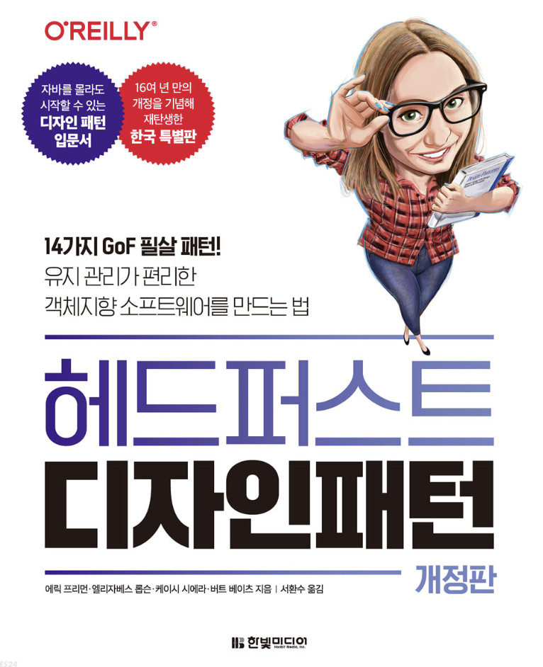

## 디자인 패턴

## 참석자
@범수 김 @상우 김

## 진행방식
- **호스트, 부호스트 제도**
    - **호스트 👮‍♂️**
        - 해당 주차의 전체적인 리딩을 전담해서 진행한다.
        - 진행방식은 호스트가 판단하에 진행. (리딩 후 퀴즈 같은)

    - **부호스트 🕵️**
        - 호스트를 도움을 주는 포지션
        - 최소 2개 해당 주차의 퀴즈나 이슈사항들을 가지고 온후 토론한다.

- 매주 월요일 오후 10시 google meet으로 진행
- 한 주에 한파트씩 범위를 가지고 갈 예정

> **깃허브 레포(**https://github.com/huckjuhwang/design-pattern**)**
>
- 월별, 주별 폴더를 만들어두고 해당 폴더의 md 파일에 공부한 내용을 요약하는 방식(필수 X)
- `github issue` 를 활용해서 책 내용 이외에 다른 부분에 대해서도 논의
    - 이슈, 활용사례, 문제 등등.
    - ex) java에서는 dart언어에서는 요렇게 활용한다.
 
## 목표
- 디자인 패턴의 대한 이해와 패턴 용어를 활용한 원활한 커뮤니케이션

## 참고사항

- 책 구매 사이트 - [링크](https://www.yes24.com/Product/Goods/108192370)
