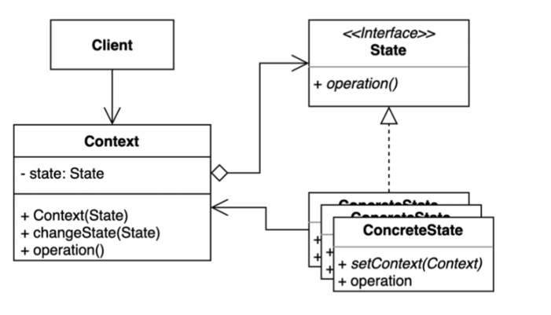

## 상태 패턴(State Pattern)

----

`상태 패턴(State Pattern)`을 사용하면 객체의 내부상태가 바뀜에 따라서 객체의 행동을 바꿀수 있다.
마치 객체의 클래스가 바뀌는것 과 같은 결과을 얻을수 있는 것이다. 


```java
여기서 '상태' 란, 객체가 가질 수 있는 어떤 조건이나 상황을 의미한다.
예를들어 자판기에서 레버를 돌리면 음료수가 나오게된다.
하지만 동전이 들어가 있지 않은 상태라면 레버를 돌린다고 하더라도 음료수가 나오지 않는다
즉, 자판기의 상태에 따라 메소드 행동이 바뀌는 것이다.

이처럼 객체가 특정 상태에 따라 행위를 달리하는 상황에서 사용되는 최적의 패턴이 state pattern 이라고 보면 된다.
```


### 상태 패턴 구조

---

- `Context` : State에 따른 적절한 ConcreteState를 선택해주고, 호출 직후 State가 변하는 경우에 처리를 해준다.
- `State`: 각 State에 따른 행위들을 인터페이스를 정의한다.
- `ConcreteState`: 구체적인 각각의 상태를 클래스로 표현. State 역할로 결정되는 인터페이스(API)를 구체적으로 구현한다. 다음 상태가 결정되면 Context에 상태 변경을 요청하는 역할도 한다.


이렇게만 보면, 이전에 포스팅 했던 전략패턴과 유사한 형태로도 보이는데 명확한 차이가 있다.

### 전략 패턴 vs 상태 패턴
전략 패턴은 클라이언트가 맞는 전략을 선택한 후에 Context에 전달을 해줬다면, 
- `상태 패턴`에서는 Context 객체에서 상태들이 캡슐화가 됩니다. Context 내부에서 상태들이 관리되다보니, 클라이언트는 해당 상태들을 알 필요가 없습니다.
- 하지만 `전략 패턴`에서는 클라이언트가 Context 객체로 어떤 전략을 선택할지 결정해줍니다. 

**정리**

---
- `전략 패턴` => 한 번 인스턴스를 생성하고 나면, 상태가 거의 바뀌지 않는 경우에 사용한다.
- `상태 패턴` =>  한 번 인스턴스를 생성하고 난 뒤, 상태를 바꾸는 경우가 빈번한 경우에 사용한다.


### 상태 패턴 구현해보기 


### 특징

---
**상태 패턴 사용 시기**

- 객체의 행동(메서드)가 상태(state)에 따라 각기 다른 동작을 할때.
- 상태 및 전환에 걸쳐 대규모 조건 분기 코드와 중복 코드가 많을 경우
- 조건문의 각 분기를 별도의 클래스에 넣는것이 상태 패턴의 핵심
- 런타임단에서 객체의 상태를 유동적으로 변경해야 할때

**상태 패턴 장점**

- 상태(State)에 따른 동작을 개별 클래스로 옮겨서 관리 할 수 있다.
- 상태(State)와 관련된 모든 동작을 각각의 상태 클래스에 분산시킴으로써, 코드 복잡도를 줄일 수 있다.
- `단일 책임 원칙`을 준수할 수 있다. (특정 상태와 관련된 코드를 별도의 클래스로 구성)
- `개방 폐쇄 원칙`을 준수 할 수 있다. (기존 State 클래스나 컨텍스트를 변경하지 않고 새 State를 도입할 수 있다)
- 하나의 상태 객체만 사용하여 상태 변경을 하므로 일관성 없는 상태 주입을 방지하는데 도움이 된다.

**상태 패턴 단점**

- 상태 별로 클래스를 생성하므로, 관리해야할 클래스 수 증가
- 상태 클래스 갯수가 많고 상태 규칙이 자주 변경된다면, Context의 상태 변경 코드가 복잡해지게 될 수 있다.
- 객체에 적용할 상태가 몇가지 밖에 없거나 거의 상태 변경이 이루어지지 않는 경우 패턴을 적용하는 것이 과도할 수 있다.