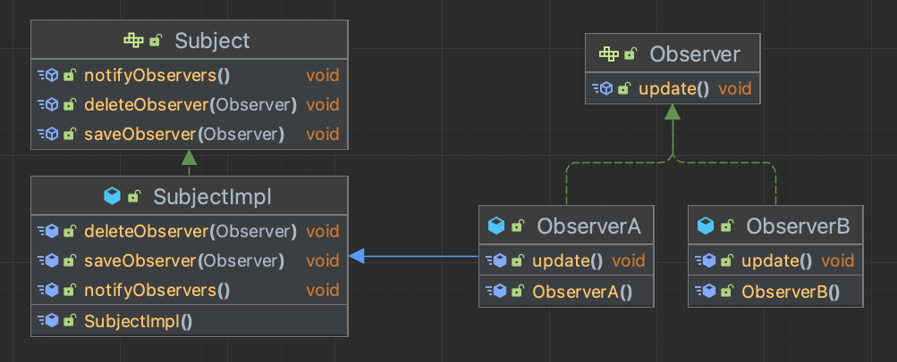
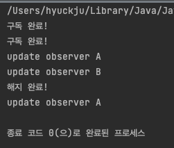
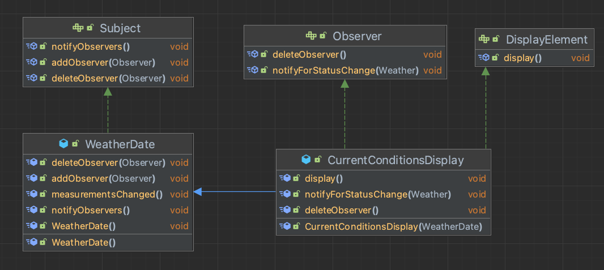
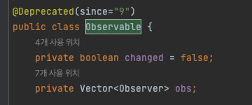

## 옵저버 패턴(Observer Pattern)
- 옵저버 패턴이란 특정 객체의 이벤트가 일어났을때, 미리 정의해둔 어떠한 동작을 수행할수 있게 해주는 프로그래밍 패턴을 의미한다.
  - `ex) 로그인이라는 버튼을 클릭했을때, 화면 전환을 해주는 동작`
- 옵저버 패턴을 활용하면 다른 객체의 상태변화를 별도의 함수 호출 없이 즉각적으로 알수 있기 때문에, 
- 이벤트에 대한 처리가 필요하다면 매우 유용하게 사용될 수 있다.

사전적인 의미는 다음과 같다.
- 한 객체의 상태가 변경되면 그 객체에 의존하는 다른 객체에게 연락이 가고 자동으로 내용이 갱신되는 방식으로 일대다(`one-to-many`)의존성을 정의한다.


### 1. 옵저버 패턴 구현
- 옵저버 패턴에는 주체 객체(subject)와 상태의 변경을 알아야 하는 관찰 객체(Observer Object)가 존재하며 이들의 관계는 1:1이 될 수도 있고 1:N이 될 수 있다.

옵저버 패턴의 기본 구조는 이와 같이 구성되는데, 


**다음과 같은 흐름으로 동작한다.**
1. 옵저버 패턴에서는 한개의 관찰자 대상(subject)와 여러개의 관찰자(observerA, observerB)가 일대다 상태로 구현되어 있다.
2. subject의 특정 상태가 변경되면 변경사항들을 옵저버한테 통보해준다 (notifyObservers 호출)
3. 통보를 받은 옵저버들은 각각 수행해야할 작업을 처리한다 (update 메서드)
4. 옵저버들은 실행시점에 추가/삭제가 가능하다. subject그룹에 구독된 상태에서는 알림을 받을수 있지만 해제된 상태에서는 받을수 없다.

### 클래스 구조
```java
public interface Subject {
    /**
     * 신규 옵저버 구독
     */
    public void saveObserver(Observer observer);

    /**
     * 기존 옵저버 해제
     */
    public void deleteObserver(Observer observer);

    /**
     * 변경 알림
     */
    public void notifyObservers();
}

public class SubjectImpl implements Subject {
  private List<Observer> observers;

  public SubjectImpl() {
    observers = new ArrayList<>();
  }

  @Override
  public void saveObserver(Observer observer) {
    observers.add(observer);
    System.out.println("구독 완료!");
  }

  @Override
  public void deleteObserver(Observer observer) {
    observers.remove(observer);
    System.out.println("해지 완료!");
  }

  @Override
  public void notifyObservers() {
    observers.forEach( observer -> {
      observer.update();
    });
  }
}
```

```java
// 구독자 정의
public interface Observer {
    /**
     * update 요청이 들어왔을때, 어떤 행동을 할지 정의.
     */
    public void update();
}

public class ObserverA extends SubjectImpl implements Observer {
  @Override
  public void update() {
    System.out.println("update observer A");
  }
}

public class ObserverB implements Observer {
  @Override
  public void update() {
    System.out.println("update observer B");
  }
}
```

### 클래스 흐름
```java
public class Client {

    /**
     * 클래스 흐름
     * @param args
     */
    public static void main(String[] args) {
        // 발행자 등록
        Subject subject = new SubjectImpl();

        // 구독할 옵저버 등록
        Observer A = new ObserverA();
        Observer B = new ObserverB();
        subject.saveObserver(A);
        subject.saveObserver(B);

        // 변경 알림 전송
        subject.notifyObservers();

        // obserber B 구독취소
        subject.deleteObserver(B);

        // 옵저버 A한테만 알림 전송
        subject.notifyObservers();
    }
}

```

### 결과



### 2. 옵저버 패턴 특징

- **패턴 사용 시기**
  - 앱이 특정한 이벤트가 일어나는 시점에, 다른 객체들을 관리해야하는 경우

- **장점**
  - subject의 상태 변경을 주기적으로 조회하지 않고, 자동으로 감지할 수 있다.
  - 발행자(subject)의 코드를 변경하지 않고도 새로운 구독자(observer)를 도입할수 있기 떄문에 OCP를 준수한다.
  
- **단점**
  - 구독자들의 알림 순서는 제어할수 없고, 무작위라고 생각하는게 좋다.
  - 다수의 옵저버 객체들을 등록한 이후 해지가 필수적으로 필요하다.
    - memory leak 발생 가능성이 있다.


### 3. 옵저버 패턴 사용 예제

현재의 날씨의 온도, 습도, 기압 데이터를 받을수 있는 데이터를 얻을수 있는 WeatherDate 클래스가 있고, 이 데이터를 얻었을때, `CurrentConditionDisplay`에서는 데이터를 얻어온 후 출력하는 구현을 하려고한다.



```java
// 추후에 weather의 데이터가 추가되어 올때를 대비하여 데이터 DTO를 정의
// 이렇게 되면 구독자 클래스를 손대지 않고, 전달값을 수정할수 있다.
public class Weather {
    public float temperature;  // 온도
    public float humidity;   // 습도
    public float pressure;  // 기압
    public Weather(){

    }

    public Weather(float temperature, float humidity, float pressure) {
        this.temperature = temperature;
        this.humidity = humidity;
        this.pressure = pressure;
    }
}
```

```java
public interface Subject {
    
    public void addObserver(Observer observer);
    public void deleteObserver(Observer observer);
    public void notifyObservers();
}


public class WeatherDate implements Subject {
  private List<Observer> observers;
  private Weather weather;

  public void WeatherDate() {
    observers = new ArrayList<>();
    weather = new Weather();
  }

  /**
   * 날씨 상태가 변경되는 시점에 해당 메서드가 호출된다.
   */
  public void measurementsChanged() {
    this.notifyObservers();
  }

  @Override
  public void addObserver(Observer observer) {
    observers.add(observer);
  }

  @Override
  public void deleteObserver(Observer observer) {
    observers.remove(observer);
  }

  @Override
  public void notifyObservers() {
    observers.forEach(observer -> observer.notifyForStatusChange(weather));
  }
}
```

```java
public interface Observer {
    public void notifyForStatusChange(Weather weather);
    public void deleteObserver();
}

public interface DisplayElement {
  /**
   * display 기기에서 노출할 데이터를 정의한다.
   */
  public void display();
}


public class CurrentConditionsDisplay extends WeatherDate implements Observer, DisplayElement {
  private WeatherDate weatherDate;
  private Weather weather;

  @Override
  public void display() {
    System.out.println("CurrentConditionsDisplay class의 display 메서드를 실행합니다.");
  }
  
  public CurrentConditionsDisplay(WeatherDate weatherDate) {
    this.weatherDate = new WeatherDate();
    weatherDate.addObserver(this);
  }

  @Override
  public void deleteObserver() {
    this.deleteObserver();
  }

  @Override
  public void notifyForStatusChange(Weather weather) {
    this.weather = weather;
    System.out.println("상태가 변경되었습니다.");
    display();
  }
}

```


옵저버 패턴의 핵심은 한 객체의 상태 변화했을떄, DIP원리에 따라 구현함으로써 유연하게 대처한다는 것입니다.


### 4. 정리
이패턴은 MVC 패턴과 되게 유사해보이는데 

네트워크 비동기 처리, UI 이벤트처리등 많은곳에서 사용이 될수 있을것 같다.


자바에서도 Observalbe이라는 내장 클래스를 지원해주는데, 인터페이스가 아닌 상속으로 지원하기 때문에, 
다른 클래스를 상속하고 있는 상태라면 사용할수 없다.


- 클래스를 보면 java9 이후에 Deprecated되어 있는것을 볼수 있다.

아마도 자바에서는 다중상속을 지원하지 않기때문에 해당 클래스를 사용하기보다, 직접 구현해서 사용하는 경우가 대부분인것 같다.


