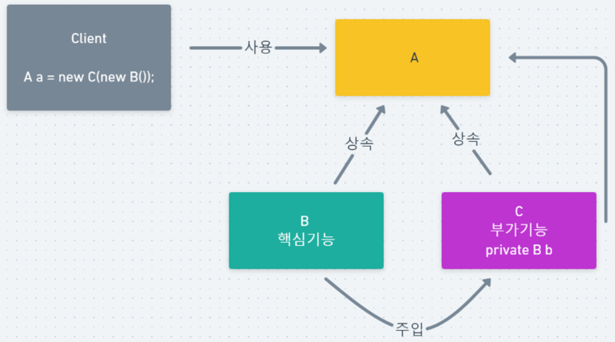
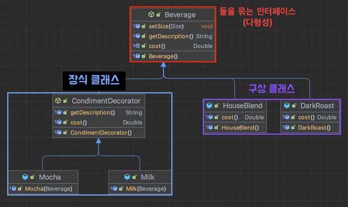
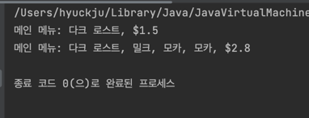

### 데코레이터 패턴(Decorator Pattern)
- 객체의 추가요소를 동적/정적으로 책임(기능)을 추가할수 있고, 서브클래스를 만들때 보다 더욱더 훨씬 유연하게 확장할수 있습니다.

### 1. 데코레이터 패턴 구조
데코레이터 패턴은 아래와 같이 그려질수 있다.


```text
A(interface)
- 핵심기능을 하는 B클래스와 핵심기능에 부가기능을 추가하는 C클래스를 하나의 타입으로 묶는 인터페이스

B
- B는 데코레이팅 할 객체로, 부가적인 기능외의 핵심 기능을 구현한다.

C
- 핵심 기능에 추가할 부가기능들이 등록된다.
```

C는 B를 주입받아 B에게 핵심 기능을 위임하고, 자신은 부가 기능에 대해서 처리한다.
- 데코레이터 패턴의 예제를 보고, 구조를 다시보면 이해가 잘될겁니다!


### 2. 데코레이터 패턴 예시
**요구 사항**
- 메인 커피가 존재하고, 해당 메인커피에는 다양한 추가재료(모카, 샷, 우유 등)가 들어갈수 있다.


```java
/**
 * 메인메뉴와 추가재로를 묶어서 추상화한 Beverage
 */
public abstract class Beverage {
    protected String description = "제목 없음";

    public String getDescription() {
        return "메인 메뉴: " + description;
    }

    public abstract Double cost();
}

/**
 * 메인커피: HouseBlend
 */
public class HouseBlend extends Beverage {
   @Override
   public String getDescription() {
      return super.getDescription() + "하우스 블랜드";
   }

   @Override
   public Double cost() {
      return 1.1;
   }
}

/**
 * 메인메뉴: DarkRoast
 */
public class DarkRoast extends Beverage {
   public DarkRoast() {
      description = "다크 로스트";
   }

   @Override
   public String getDescription() {
      return super.getDescription();
   }

   @Override
   public Double cost() {
      return 1.5;
   }
}

```


```java
/**
 * 추가 재료들을 관리할 Decorator
 * beverage에 실제 책임은 전달해야하므로 Beverage를 가지고 있다.
 */
public abstract class CondimentDecorator extends Beverage {
    Beverage beverage;
    protected double decoratorCost;

    protected String title;

    @Override
    public Double cost() {
        return beverage.cost() + decoratorCost;
    }

    @Override
    public String getDescription() throws Exception {
        return beverage.getDescription() + ", " + title;
    }
}

/**
 * 추가 재료: 모카
 */
public class Mocha extends CondimentDecorator {

   public Mocha(Beverage beverage) {
      this.beverage = beverage;
   }

   @Override
   public String getDescription() {
      return beverage.getDescription() + ", 모카";
   }

   @Override
   public Double cost() {
      return beverage.cost() + 0.5;
   }
}

/**
 * 추가 재료: 우유
 */
public class Milk extends CondimentDecorator {

   public Milk(Beverage beverage) {
      this.beverage = beverage;
   }

   @Override
   public String getDescription() {
      return beverage.getDescription() + ", 밀크";
   }

   @Override
   public Double cost() {
      return beverage.cost() + 0.3;
   }
}

```


```java
public class Client {
    public static void main(String[] args) {
        Beverage mainMenu = new DarkRoast();
        System.out.println(mainMenu.getDescription() + ", $" + mainMenu.cost());

        Beverage mainMenu2 = new DarkRoast(); // 1.5
        mainMenu2 = new Milk(mainMenu2);  // 0.3$, 밀크 추가
        mainMenu2 = new Mocha(mainMenu2); // 0.5$, 모카 추가
        mainMenu2 = new Mocha(mainMenu2); // 0.5$, 모카 추가

        System.out.println(mainMenu2.getDescription() + ", $" + mainMenu2.cost());
    }
}
```



### 2. 데코레이터 패턴 특징
**패턴 장점**

- 데코레이터를 사용하면 서브클래스를 만들때보다 훨씬 더 유연하게 기능을 확장할 수 있다.
- 객체를 여러 데코레이터로 래핑하여 여러 동작을 결합할 수 있다.
- 컴파일 타임이 아닌 런타임에 동적으로 기능을 변경할 수 있다.
- 각 장식자 클래스마다 고유의 책임을 가져 단일 책임 원칙(SRP)을 준수
- 클라이언트 코드 수정없이 기능 확장이 필요하면 장식자 클래스를 추가하면 되니 개방 폐쇄 원칙(OCP)을 준수
- 구현체가 아닌 인터페이스를 바라봄으로써 의존 역전 원칙(DIP) 준수

**패턴 단점**
- 부가기능과 핵심기능을 결합하기 위해 어디선가 관계를 지정해줘야 한다. 위의 코드에서는 클라이언트가 그 책임을 맡고있다.
- 어느 장식자를 먼저 데코레이팅 하느냐에 따라 결과가 달라지기 때문에 데코레이팅 순서를 잘 적용해야한다.
  - 이런 오류는 문제를 야기하기 때문에, 장식자를 감쌀때 올바른 로직인지 개발자는 끊임 없이 검토를 수행해야한다.

