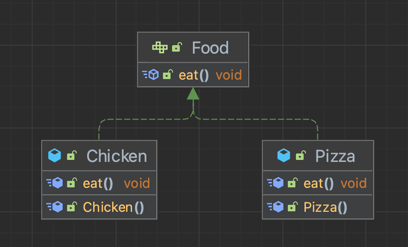
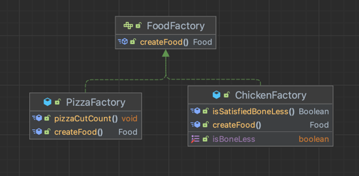
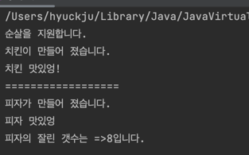

## 팩토리 패턴 (Factory Pattern)

----
- 객체를 생성하는 코드만 분리하여 클라이언트가, 특정 객체의 생성과정을 몰라도 쉽게 생성할수 있게 해주는 패턴이다.
- OCP를 지키기 위해 변경 가능성이 큰 객체 생성을 담당하는 클래스를 분리한다.

### 팩토리 => 공장(class or function)
- 오브젝트를 찍어 낼수 있는 공장

피자, 치킨
- (그림추가)
food(상위 클래스) -> chikine, pizza


client는 그냥 공장에 "피자를 만들어줘", "치킨을 만들어줘"만 알려주면 공장에서 해당 음식의 생성과정을 통해서 음식을 전달해준다.
- 즉, 생성과정을 알 필요가 없다는 이야기랑 같다.


### 팩토리 패턴 구현해보기
- 팩토리 메서드 패턴을 구현해보면 다음과 같다
```java
public interface Food {
    public void eat();
}

public class Chicken implements Food {
    @Override
    public void eat() {
        System.out.println("치킨 맛있엉!");
    }
}

public class Pizza implements Food {
    @Override
    public void eat() {
        System.out.println("피자 맛있엉");
    }
}
```

```java
// 음식 만드는 공장
public class Factory {
    // 현업에서는 enum으로 정의해야함(type-safety)
    public Food createFood(String foodName) {
        if(foodName.equals("CHICKEN")) {
            return new Chicken();
        } else if(foodName.equals("PIZZA")){
            return new Pizza();
        }
        return null;
    }
}
```
```java
public static void main(String[] args) {
    Factory factory = new Factory();
    Food chicken = factory.createFood("CHICKEN");
    chicken.eat();

    Food pizza = factory.createFood("PIZZA");
    pizza.eat();
}
```

이러한 object 생성과정을 클라이언트가 직접 다룰 필요가 없다.
- 위 예제에서는 간단하기 때문에 공감이 안될수도 있으니 예시를 하나 들어보자!

피자를 만들기 위해서는 총4가지의 과정이 필요했다면??
```text
- 준비
- 굽기
- 자르기
- 포장하기
```
(4가지 절차가 있는 그림 넣기)

- 클라이언트는 지금과 다른것 없이 피자를 주문할수 있을것 이다.

- 이게 팩토리 패턴의 장점이다.
- 클라이언트 입장에서는 객체를 생성하기위한 위와 같은 과정을 몰라도 `PIZZA` 키워드만 보냄으로써 해당 객체를 쉽게 생성할수 있도록 해주는것이 핵심이다.

### 팩토리 패턴 한계
- 요구사항이 추가되면서, 음식에 따라 필요한 메서드들이 생기게 되었다.

  - 피자는 잘라지는 조각 갯수를 제공해야했고, 
  - 순살로 변경해서 주문하는것이 가능한지 여부를 제공해야했다.

이런 경우에는 추가구현을 하는건 어려움이 있다. 하나의 팩토리에 모든 생성 객체에 대한 코드가 들어가기 때문에 복잡해진다.

- 이러한 문제를 팩토리 메서드 패턴에서 해결할수 있다.
  - 팩토리 패턴의 생성 메서드를 Interface화 시킨다
  

각각의 factory를 생성한다. (피자, 치킨)
- (그림 추가, 피자 치킨에 대한 각각 생성 )

- 이를 위한 interface를 정의하고, CreateFood라는 객체 메서드를 제공한다.
- 객체에 따라 따로 팩토리를 만들었음으로, 객체에따라 기능구현이 가능해진다.
  (`피자를 몇조각으로 짜르는지, 치킨은 순살이 가능한지 여부`)

코드로 한번 살펴보자

### 팩토리 메서드 패턴 구현해보기 
```java

public interface FoodFactory {
    public Food createFood();
}

// 피자 공장
public class PizzaFactory implements FoodFactory {
    private Long pizzaCutCount;

    public PizzaFactory() {
        pizzaCutCount = 8L;
    }

    public void pizzaCutCount() {
        System.out.println("피자의 조각 갯수는 => " + pizzaCutCount + "입니다.");
    }

    @Override
    public Food createFood() {
        System.out.println("피자가 만들어 졌습니다.");
        return new Pizza();
    }
}

// 치킨공장
public class ChickenFactory implements FoodFactory {
    // 순살여부를 지원하는가
    private boolean isBoneless;

    public ChickenFactory() {
        isBoneless = true;
    }

    public ChickenFactory(boolean isBoneless) {
        this.isBoneless = isBoneless;
    }

    public void setIsBoneLess(boolean isBoneless) {
        this.isBoneless = isBoneless;
    }

    public Boolean isSatisfiedBoneLess()  {
        if(isBoneless) {
            System.out.println("순살을 지원합니다.");
        } else {
            System.out.println("순살을 지원하지 않습니다.");
        }

        return isBoneless;
    }


    @Override
    public Food createFood() {
        System.out.println("치킨이 만들어 졌습니다.");
        return new Chicken();
    }
}
```

```java
public static void main(String[] args) {
    ChickenFactory chickenFactory = new ChickenFactory();

    /**
     * 순살 가능여부 체크
     */
    Boolean satisfiedBoneLess = chickenFactory.isSatisfiedBoneLess();
    if(satisfiedBoneLess) {
      Food food = chickenFactory.createFood();
      food.eat();
    }

    System.out.println("==================");

    PizzaFactory pizzaFactory = new PizzaFactory();
    Food food = pizzaFactory.createFood();
    food.eat();
    pizzaFactory.pizzaCutCount();
    }
}
```
### 결과


팩토리 메서드 패턴의 핵심은, factory interface가 있고, 각 객체마다 해당 interface의 object creater를 하는 메서드를 구현하고 있다는것이 핵심이다.

- 실제 현업에서는 서브클래스의 네이밍을 다르게 쓰는 경우가 있다. ~~Manager, ~~Creator
   - object creater 하는 메서드가 상속되어있다면, 팩토리 메서드 패턴을 사용했구나 라고 이해하면된다.

- 이 패턴에서는 하나의 오브젝트가 == 하나의 factory와 매칭이 될 필요는 없다.(여러개가 매칭되어도됨 )
- 오브젝트를 생성하는 메서드가 상속이 되었는가, 즉, 오브젝트를 만들어 내는 클래스가 상속이되어있느냐를 핵심으로 본다면 필요한 시점에 활용하기 좋을것 이다.


### 한계
- 그런데 갑자기 추가 요청이 들어오게되었다.

- 모든 음식에, 사이드메뉴랑 소스도 제공을 해줘야한다는 내용이였다. 

- 이를 구현하려면 각 팩토리에 사이드랑 소스 제공 메서드를 전달해주면될까?
- X, 이렇게 되었을때, 특정 객체에서 구현하지 않았을경우 문제가 될수 있다. 놓치고, 개발을 하지 않을수 도 있기때문에 이것에 대한 해결방법이 필요하다.


- 각각(치킨, 피자의) 추상 인터페이스를 구현하고, 서비스 물품에 해당하는 제품(소스, 사이드메뉴)의 구현도 필요하다.
* - 이후 각 추상 팩토리에서, 구현체에 맞는 제품을 리턴해주는 방식
'

```java
public interface FoodServiceMenuAbstractFactory {
    /**
     * 음식에 따른 소스 제공
     */
    public Source createSource();

    /**
     * 음식에 따른 사이드 메뉴 제공한다.
     */
    public SideMenu createCommonSide();
}

public class ChickenServiceMenuFactory implements FoodServiceMenuAbstractFactory {
    @Override
    public Source createSource() {
        return new ChickenSourceFactory();
    }

    @Override
    public SideMenu createCommonSide() {
        return new ChickenSideMenuFactory();
    }
}

public class PizzaServiceMenuFactory implements FoodServiceMenuAbstractFactory {
    @Override
    public Source createSource() {
        return new PizzaSourceFactory();
    }

    @Override
    public SideMenu createCommonSide() {
        return new PizzaSideMenuFactory();
    }
}


public class ChickenFactory implements FoodFactory {

    ...
    
    @Override
    public Food createFood() {
        System.out.println("치킨이 만들어 졌습니다.");

        // 추가@@
        ChickenServiceMenuFactory chickenServiceMenuFactory = new ChickenServiceMenuFactory();
        chickenServiceMenuFactory.createSource().getSource();
        chickenServiceMenuFactory.createCommonSide().getSideMenu();

        return new Chicken();
    }
}

public class PizzaFactory implements FoodFactory {
    ...
    
    @Override
    public Food createFood() {
        System.out.println("피자가 만들어 졌습니다.");

        // 추가@@
        FoodServiceMenuAbstractFactory pizzaServiceMenuFactory = new PizzaServiceMenuFactory();
        pizzaServiceMenuFactory.createSource().getSource();
        pizzaServiceMenuFactory.createCommonSide().getSideMenu();

        return new Pizza();
    }
}

```

- 각 팩토리에서 정의해줘도 되지 않은가?
   - 이전과 같은 이유때문에 힘들다. 이것또한 소스와 사이드를 필수로 제공해줘야하는데, 각 객체에 따라 구현해주지 않는 경우가 있을수 있다.


* - 아무래도 구현체에 의존을 하게될수 있을것 같음.


* factory method pattern :
* - 객체 생성에 대한 책임을 서브클래스로 넘겨서, 서브클래스에서 형태가 정해지는 패턴
* - 객체기준으로 보는거고, 자신이 사용할 추상 클래스만 알면된다.
* - 클라이언트와 구상형식을 분리하는 역할
*
* abstract factory method pattern:
* - 선택된 클래스에 맞는 데이터를 가지고 오는 패턴
* - 클래스 기준으로 보는거고,
* - 제품군을 만드는 추상형식을 제공한다.
* - 즉, 제품에 따른 다른 데이터를 가지고 와야할때 사용한다.
* - 치킨에 대한 서비스 물품들과, 피자에 대한 서비스 물품을 받아오고 싶을때 사용한다.
- 
### 

## 1. Simple Factory
### 기존 코드의 문제
```java
Duck duck;
if (picnic) {
	duck = new MallardDuck();
}
else if (hunting) {
	duck = new DcoyDuck();
})
```
인터페이스를 사용해서 코드를 유연하게 만드려고 했으나, 특정 구현 클래스에 의존적
=> 변경이나 확장이 어려운 코드

### 변경되는 부분 찾기
```java
Pizza orderPizza(String type) {
    Pizza pizza;
    
	// 피자 종류가 바뀔 때마다 코드를 계속 수정해야한다.
    if (type.equals("cheese")) {
        pizza = new CheesePizza(); 
    } elseif(type.equals("greek")) {
        pizza = new GreekPizza(); 
    } else if (type.equals("pepperoni") { 
        pizza = new PepperoniPizza();
    }
    
    // 아래 코드는 바뀌지 않는다.
	pizza.prepare(); //피자 준비
    pizza.bake();  // 피자 굽기
    pizza.cut();  //피자 자르기
    pizza.box();  // 피자 상자에 담기
    return pizza;
 }
```
인스턴스를 만뜨는 구상 클래스를 선택하는 부분은 변경 될 수 있는 부분.
OCP 원칙을 지키기 위해 변경될 수 있는 부분을 나머지 부분으로부터 분리(캡슐화)

### 팩토리 만들기
Factory: 객체 생성을 처리하는 클래스
```java
public class SimplePizzaFactory {

    public Pizza createPizza(String type) {
        Pizza pizza = null;

        if (type.equals("cheese")) {
            pizza = new CheesePizza();
        } else if (type.equals("pepperoni")) {
            pizza = new PepperoniPizza();
        } else if(type.equals("clam")) {
            pizza = new ClamPizza();
        } else if(type.equals("veggie")) {
            pizza = new VeggiePizza();
        }
    return pizza;
    }
}
```

- 피자 객체 생성 작업이 필요한 클라이언트가 많을 경우, 해당 클라이언트에서 수정할 필요 없이, 팩토리 클래스 하나만 고칠 수 있다.
- static factory method: 정적 메소드를 쓰면 팩토리 객체의 인스턴스를 만들지 않아도 된다. 하지만 서브클래스를 만들어 객체 생성 메소드의 행동을 변경할 수 없다는 단점도 있다.

PizzaStore
```java
public class PizzaStore {
    SimplePizzaFactory factory;

    public PizzaStore(SimplePizzaFactory factory) {
        this.factory = factory;
    }

    public Pizza orderPizza(String type) {
        Pizza pizza = factory.createPizza(type);

        pizza.prepare();
        pizza.bake();
        pizza.cut();
        pizza.box();

        return pizza;
    }
}
```

## 2. 팩토리 메서드 패턴
다양한 팩토리를 만들고, PizzaStore와 피자 제작 코드를 묶어준다.
SimplePizzaFactory -> NYPizzaFactory, ChicagoPizzaFactory, CaliforniaPizzaFactory
```java
NYPizzaFactory nyFactory = new NYPizzaFactory(); 
PizzaStore nyStore = new PizzaStore(nyFactory);
nyStore.orderPizza("Veggie"); 

ChicagoPizzaFactory chicagoFactory = new ChicagoPizzaFactory(); 
PizzaStore chicagoStore = new PizzaStore(chicagoFactory); 
chicagoStore.orderPizza("Veggie"); 
```

### PizzaStore
SimpleFactory 방식에서는 Factory에 넣었던 createPizza를 다시 PizzaStore에 넣고, 추상 메소드로 선언하여 서브클래스에서 수정할 수 있도록 한다.
```java
public abstract class PizzaStore {

    public Pizza orderPizza(String type) {
        Pizza pizza = createPizza(type); //서브클래스에서 결정

        pizza.prepare();
        pizza.bake();
        pizza.cut();
        pizza.box();

        return pizza;
    }

    abstract Pizza createPizza(String type); //팩토리 객체 대신 이 메소드를 사용!
}
```

### NYPizzaStore
```java
public class NYPizzaStore extends PizzaStore {
	
    @Override
    Pizza createPizza(String type) {
        if (type.equals("cheese")) {
            return new NYStyleCheesePizza();
        } else if (type.equals("pepperoni")) {
            return new NYStylePepperoniPizza();
        } else if(type.equals("clam")) {
            return new NYStyleClamPizza();
        } else if(type.equals("veggie")) {
            return new NYStyleVeggiePizza();
        } else {
            return null;
        }
    }

	public class NYStyleCheesePizza extends Pizza {

		public NYStyleCheesePizza() {
			name = "뉴욕 스타일 소스와 치즈 피자";
			dough = "씬 크러스트 도우";
			sauce = "마리나라 소스";
		}
	}
}
```

### consumer 코드
```java
  NYPizzaFactory nyFactory = new NYPizzaFactory();
  PizzaStore nyStore = new PizzaStore(nyFactory);
  nyStore.orderPizza("cheese");
```
기존에는 피자가게와 피자를 생성하는 부분이 나뉘어져있었다면, 이제는 피자가게가 피자를 생성하는 부분을 포함.
```java
    PizzaStore pizzaStore = new NYPizzaStore();
    pizzaStore.orderPizza("cheese");
```

### 팩토리 메소드 패턴의 정의
클래스 인스턴스를 만드는 일을 서브클래스에게 맡긴다.
객체를 생성할 때 필요한 인터페이스를 만들고, 서브클래스에서 생산할 객체 인스턴스를 결정.

## 의존성 뒤집기 원칙
Dependency Inversion Principle:
추상화된 것에 의존하게 만들고,
구상 클래스에 의존하지 않게 만든다. 

고수준 구성 요소가 저수준 구성 요소에 의존하면 안되며 항상 추상화에 의존하게 만들어야한다.

PizzaStore: 고수준 구성 요소, Pizza: 저수준 구성 요소

```java
public Pizza createPizza(String style, type) {
	Pizza pizza = null;
	if (style.equals = "NY") {
		if (type.equals("cheese")) {
			pizza = new NYStyleCheesePizza();
        } else if (type.equals("veggie")) {
			pizza = new NYStyleVeggiePizza();
        }
		//....
    }
}
```
위와 같이 PizzaStore에서 구체적인 피자 클래스들을 의존하게 되면 구상 클래스가 변경될 때 PizzaStore까지 바뀌어야할 수 있다.

그래서 팩토리 메소드 패턴을 사용해서 pizza 인스턴스를 만드는 부분을 뽑아내어서 의존성 뒤집기 원칙을 준수하도록 할 수 있다.

가이드라인
1) 변수에 구상 클래스의 레퍼런스를 저장하지 말자
2) 구상 클래스에서 유도된 클래스를 만들지 말자 (인터페이스나 추상 클래스처럼 추상화된 것으로부터 클래스를 만들자)
3) 베이스 클래스에 이미 구현되어 있는 메소드를 오버라이드하지 말자
- 이미 구현되어 있는 메소드를 오버라이드하면 베이스 클래스가 제대로 추상화되지 않는다.
- 베이스 클래스에는 모든 서브클래스에서 공유할 수 있는 것만 정의하자.

## 3. 추상 팩토리 패턴
### 원재료 팩토리
피자 종류에 맞는 원재료를 생산하는 추상 팩토리 도입
```java
public interface PizzaIngredientFactory {

    public Dough createDough();
    public Sauce createSauce();
    public Cheese createCheese();
    public Veggies[] createVeggies();
    public Pepperoni createPepperoni();
}
```

```java
public class CheesePizza extends Pizza {
    PizzaIngredientFactory ingredientFactory;
    
    public CheesePizza(PizzaIngredientFactory ingredientFactory) {
        this.ingredientFactory = ingredientFactory;
    }
    
    void prepare() {
        dough = ingredientFactory.createDough();
        sauce = ingredientFactory.createSauce();
        cheese = ingredientFactory.createCheese();
    }
}
```

```java
public class NYPizzaStore extends PizzaStore {
	protected Pizza createPizza(String item) {
		Pizza pizza = null;
		PizzaIngredientFactory ingredientFactory = 
            new NYPizzaIngredientFactory();
		
		if (item.equals("cheese")) {
			pizza = new CheesePizza(ingredientFactory);
		}
		//...
    }
}
```

추상 팩토리 패턴:
구상 클래스에 의존하지 않고도 서로 연관되거나 의존적인 객체로 이루어진 제품군을 생산하는 인터페이스 제공
구상 클래스는 서브클래스에서 만듦. 
클라이언트와 팩토리에서 생산되는 제품을 분리할 수 있음. 

팩토리 메소드 vs 추상 팩토리 패턴
- 팩토리 패턴은 한 종류의 객체를 생성하기 위해 사용. 추상 팩토리 패턴은 연관되거나 의존적인 객체로 이루어진 여러 종류의 객체를 생성하기 위해 사용
- 팩토리 패턴은 팩토리 인터페이스를 구현, 추상 팩토리는 팩토리 객체가 아닌 다른 객체 내부에 구현되어 해당 객체에서 여러 타입의 객체를 생성하기 위해 사용. 

## 다이어그램
### Simple Factory


### Factory Method Pattern


### Abstract Factory Pattern

