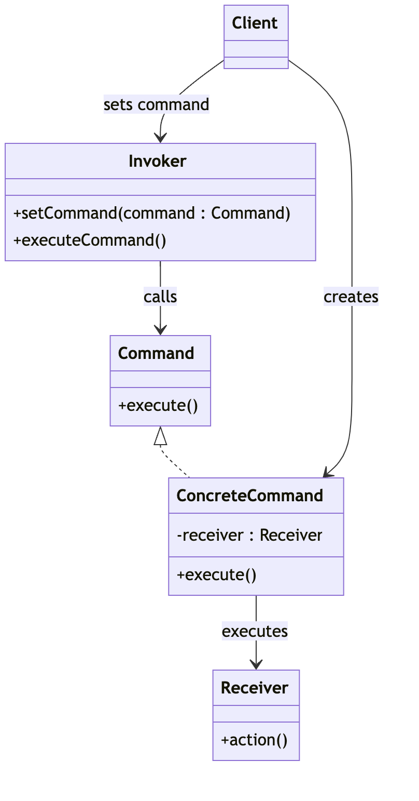

## 커맨트 패턴
요청을 객체의 형태로 캡슐화 하여 사용자가 서로 다른 요청, 큐 또는 로그 요청을
매개변수로 사용할 수있께 하고 작업을 수행할 수 있는 기능을 제공합니다.

### 1. 커맨드 패턴을 사용하는 이유
이 패턴은 명령을 발행하는 객체(Invoker)와 명령을 실행하는 객체(Receiver)를 분리함으로써 요청하는
객체와 요청을 수행하는 객체 사이의 결합도를 낮출 수 있습니다. 

### 2. 커맨드 패턴의 주요 구성요소
* Command

실행될 모든 명령에 대한 인터페이스 입니다.
이 인터페이스는 excute 메서드를 정의하여 명령을 실행하는데 필요한 작업을 선언합니다.

* ConcreteCommand

Command 인터페이스를 구현하고 리시버 객체에 대한 특정 요청과 연결 합니다.
excute 메소드를 오버라이드하여 수신자에게 특정 작업을 수행합니다.

* Receiver

실제로 작업을 수행하는 객체이고 ConcreateCommand는 이 Receiver에 대한 요청을 처리합니다.

* Invoker

Command 객체를 보관하며 명령을 실행할 메서드를 호출합니다.
-> Command 객체의 excute 메서드를 호출하여 명령을 수행

* Client

ConcreateCommand 객체를 생성하고 Reciever 객체를 설정합니다.
또한 Invoker에게 명령을 실행하도록 요청합니다.

### 커맨드 패턴의 구조


### 3. 간단한 커맨드 패턴 구현

Command 인터페이스
```java
public interface Command {
    void execute();
}
```

ConcreteCommand 클래스
```java
public class LightOnCommand implements Command {
    private Light light;

    // LightOnCommand 객체가 생성될때 light 자동 주입
    public LightOnCommand(Light light) {
        this.light = light;
    }

    @Override
    public void execute() {
        light.turnOn();
    }
}
```

Receiver 클래스
```java
public class Light {
    public void turnOn() {
        System.out.println("Light is on");
    }

    public void turnOff() {
        System.out.println("Light is off");
    }
}
```

Invoker 클래스
```java
public class RemoteControl {
    private Command command;

    // RemoteControl 객체가 생성될떄 command 주입
    // command 객체 보관 .. 
    public void setCommand(Command command) {
        this.command = command;
    }

    public void pressButton() {
        command.execute();
    }
}
```

클라이언트
```java
public class Client {
    public static void main(String[] args) {
        Light light = new Light();
        Command lightsOn = new LightOnCommand(light);
        RemoteControl remote = new RemoteControl();

        remote.setCommand(lightsOn);
        remote.pressButton();
    }
}
```


### Q1. 커맨드 패턴으로 간단한 택스트 편집기 프로그램을 구현하기
- 텍스트 복사, 텍스트 붙여넣기, 텍스트 잘라내기 기능이 필요


