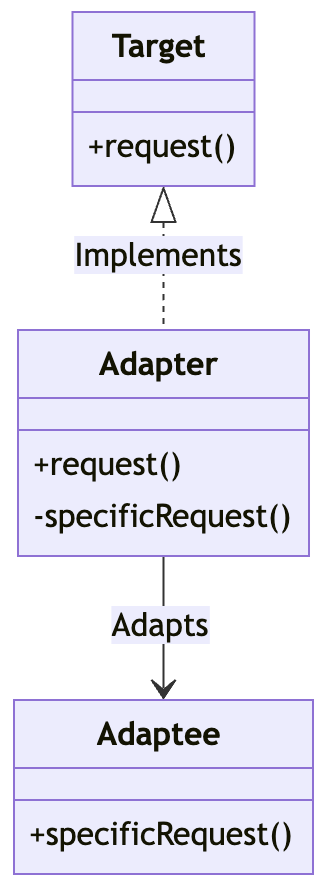

## 어댑터 패턴
한 인터페이스를 다른 인터페이스로 변환하는데 사용되는 구조적 디자인 패턴입니다.

### 1. 어탭터 패턴을 사용하는 이유
기존의 클래스나 객체가 필요한 인터페이스와 맞지 않을때, 
그것을 다른 인터페이스로 감싸서 호환성을 확보하고 상호운영성을 제공하기 위해 사용됩니다.

### 2. 어댑터 패턴의 주요 구성요소
* Target
클라이언트가 사용하는 인터페이스를 정의합니다.

* Adapter
Target 인터페이스를 구현하고 내부적으로 Adaptee 메서드를 호출합니다. 

* Adaptee
Adapter가 사용하는 기존 인터페이스를 정의합니다.
### 어댑터 패턴의 구조



### 2. 간단한 어댑터 패턴 구현

칠면조를 오리 어댑터로 감싸 오리 만들기

Target 인터페이스
```java
public interface Duck {
    public void quack();
    public void fly();
}
```

Adapter 클래스
```java
public calss TurkeyAdapter implements Duck {
    Turkey turkey;

    public TurkeyAdapter(Turkey turkey) {
        this.turkey = turkey;
    }

    public void quack() {
        turkey.gobble();
    }

    public void fly() {
        turkey.fly();
    }
}
```

Adaptee 인터페이스
```java
public interface Turkey() {
    public void gobble();
    public void fly();
}
```

Adaptee 구현체
```java
public class WildTurkey implements Turkey {
    public void gobble() {
        sout("골골");
    }
    public void fly() {
        sout("짧은 거리를 날고 있어요.");
    }
}
```

클라이언트
```java
public class DuckTestDrive {
    public statis void main(String[] args) {

        Turkey turkey = new WildTurkey(); // Adaptee 생성
        Turkey turkeyAdapter = new TurkeyAdapter(turkey); // Adaptee를 adapter로 감싸서 duck 객체처럼 보이게 만듬

        TestDuck(turkeyAdapter);
    }

    public void testDuck(Duck duck) {
        duck.quack();
        duck.fly();
    }
}
```


