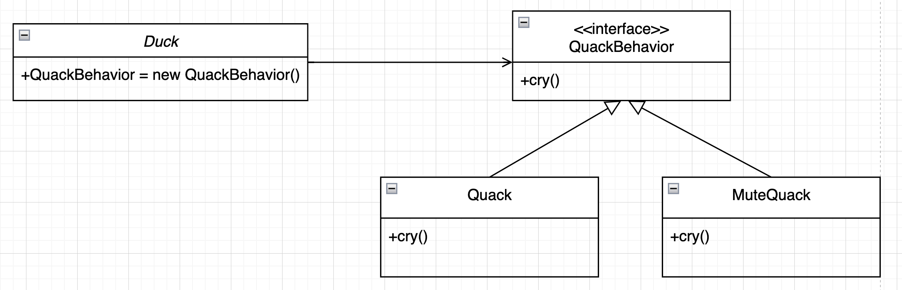

## 전략 패턴(Strategy Pattern)
객체들이 할수 있는 행위들을 각각의 집합(전략)으로 만들어놓고, 
클라이언트 쪽에서 전략을 바꾸는것 만으로 행위의 수정이 가능하도록 만든 패턴입니다.

### 1. 전략패턴을 사용해야하는 이유
요구사항
- 오리(Duck)가 있고, 이 오리는 나이에 따라서 꽉꽉(Quack)또는 소리를 못내는(MuteQuack) 오리일수도 있습니다.

이 구조를 그려보면 <br>


이와같이 구성이 가능되고, 위 구조를 프로그래밍 언어로 표현해 보면 다음과 같습니다.

```java
public interface QuackBehavior {
    public void cry();
}

public class Quack implements QuackBehavior {
    @Override
    public void cry() {
        System.out.println("Quack Quack(꽉꽉!~)");
    }
}

public class MuteQuack implements QuackBehavior {
    @Override
    public void cry() {
        System.out.println("...(MuteQuack)");
    }
}
```

```java
public class Duck {
    private QuackBehavior quackBehavior;
    
    public Duck Duck() {
        quackBehavior = new MuteQuack();
    }
    
    /**
     * 오리(Duck)를 울게 할수 있는 메서드
     * @return
     */
    public void cry() {
        quackBehavior.cry();
    }
}
```

```java
public class Client {
    public static void main(String[] args) {
        Duck duck = new Duck();
        duck.cry();  // ...(MuteQuack)
    }
}
```
조금 시간이 지나고, 오리가 조금 자라게되어 소리를 낼수 있게 되었습니다. 

---

**문제점**
- 이미 특정 구현에 맞춰서 프로그래밍을 했기 때문에(Duck은 울지 못한다), 
  - runTime 시점에 유연하게 변경이 불가능하고, 
- 수정/확장 또한, 신규 울음소리가 추가된다고 해도 Duck클래스에 직접적인 수정(생성자)이 들어가야하므로 `OCP(Open Closed Principle)`를 위배하게 됩니다.


**(중요) 이와 같은 문제를 해결하기 위해서 전략패턴을 사용할수 있습니다.**


### 2. 전략 패턴 구현
전략패턴을 사용하여 어떻게 해결할수 있냐면

- 클라이언트가 오리(Duck)가 어떻게 소리를 내야 할지 전략을 선택할수 있도록 해주면 된다.
  - 즉, 그 값(전략)을 셋팅할수 있는 인터페이스를 외부에 공개해주면 됩니다.
- 여기서의 전략은 꽉꽉(Quack), 소리를 못내는(MuteQuack) 2가지중에 한가지를 선택할 수 있을겁니다.

```java

public class Duck {
    private QuackBehavior quackBehavior;
    
    public void setQuickBehavior(QuackBehavior quickBehavior){
        this.quickBehavior = quickBehavior;
    }

    ...
}
```

이제 client 입장에서 원하는 Duck의 소리를 내도록 구현해보면 다음과 같습니다.

```java
public class main {
    public static void main(String[] args) {
        Duck duck = Duck();
        duck.setQuackBehavior(new MuteQuack());
        duck.cry();  // ...(MuteQuack)
        
        // ... 1개월 후, 소리를 낼수 있을 정도로 크게 되었다.
        
        duck.setQuackBehavior(new Quack());
        duck.cry();  // Quack Quack(꽉꽉!~)
    } 
}

```

**요구사항 추가**
- 오리에게 조금 더 작은소리가 추가 되었다!!
```java
public class Squack implements QuackBehavior {
    @Override
    public void cry() {
        System.out.println("Squack Squack(곽곽..)");
    }
}
```
- 이러한 울음소리가 추가되더라도, Duck클래스의 setter함수를 통해서 어떤 울음을 내게할지 전략을 주입만 해준다면,
- 새로운 울음소리가 추가되어도 Duck클래스는 수정하지 않고도 확장해 나아갈수 있습니다. 
```java
public class main {
    public static void main(String[] args) {
        Duck duck = Duck();
        duck.setQuackBehavior(new MuteQuack());
        duck.cry();  // ...(MuteQuack)
        
        // ... 1개월 후, 소리를 낼수 있을 정도로 크게 되었다.
        
        duck.setQuackBehavior(new Quack());
        duck.cry();  // Quack Quack(꽉꽉!~)
    } 
}
```


### 특징
**장점**
- 알고리즘을 정의하고 캡슐화하여 런타임 시에 알고리즘을 선택하기 때문에 쉽게 변경 및 대체할 수 있음(유연함)
- 전략을 추가 및 수정을 할 때 타 클래스의 코드 수정이 최소화되므로 OCP를 
- 알고리즘을 캡슐화했기에 코드 재사용성이 좋음
- 각각 알고리즘을 독립적으로 테스트할 수 있으므로 용이함

**단점**
- 추가적인 클래스 및 인터페이스가 필요하기에 코드 복잡성이 증가될 수 있음
- 런타임 시에 알고리즘을 선택하는 데 추가적인 오버헤드 발생 가능

----


### Q. Duck의 종류가 여러명이 되었을 경우에는 어떤 식으로 구조를 변경해야할까?
- 현재는 청둥오리, 미운오리새끼, 가오리가 있다.
- 추후, 동물의 따라 display모습을 보여주려고 한다.


### Q. 현재 닭의 상태를 출력해주는 구조를 만들려면 어떤식으로 구성해야할까??
- 현재는 물에 떠있는 상태, 밥을 먹는 상태, 걷는 상태 3가지고, 앞으로 상태는 늘어날 수 있다.
- 추후 상태에 따라 위협적인 동물이 나타났을때 행동을 정의하려고 한다.


