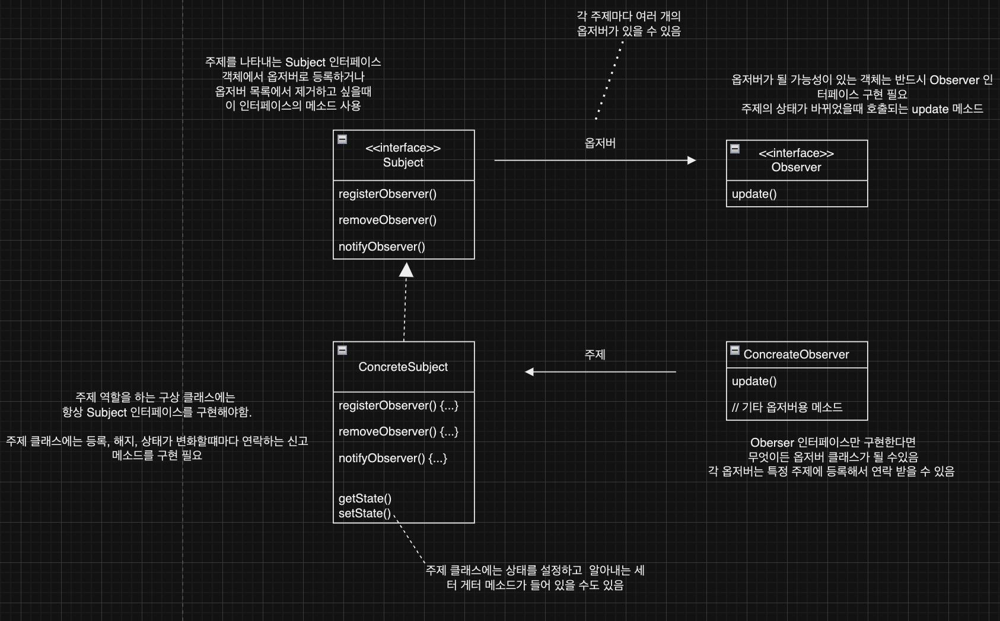
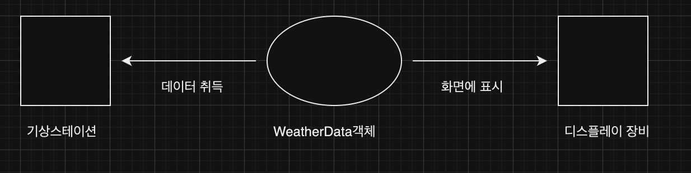

## 옵저버패턴
한 객체의 상태가 바뀌면 그 객체에 의존하는 다른 객체들한테 연락이 가고
자동으로 내용이 갱신되는 방식되도록 즉, 객체간의 일대다 종속성을 정의하는 패턴입니다.

### 옵저버 패턴의 구조


### 1. 옵저버 패턴을 사용해야하는 이유
예를 들어 기상 모니터링 애플리케이션을 개발

구성 요소
1. 기상 스테이션(실제 기상 정보를 수집)
2. weatherData 객체 (기상스테이션으로 부터 오는 데이터를 축적)
3. 사용자에게 현재 기상 조건을 보여주는 디스플레이



이런 구성으로 되어있고 위 구성을 표현한 코드


```java
public class WeatherData {

  // 기상 관측값이 갱신될 때 마다 알려주기 위한 메소드
	public void measurementChanged() {
	float temp = getTemperture();
	float humidity = getHumidity();
	float pressure = getPressure();

	// 각 디스플레이 항목을 불러서 디스플레이를 갱신 메소드
	currentConditionDisplay.update(temp, humidity, pressure);
	statisticsDisplay.update(temp, humidity, pressure);
	forecastDisplay.update(temp, humidity, pressure);
	}
}

```
**문제점**
구체적인 구현에 맞춰서 코딩했기 때문에 프로그램을 고치지 않고
다른 디스플레이 항목을 추가하거나 제거 할 수 없습니다.

**이 문제를 해결하기 위해서 옵저버 패턴을 사용할 수 있습니다.**


### 2. 옵져버 패턴 구현

기상 스테이션 구현
```java
public interface Subject {
  // 각각 옵저버를 등록하고 제거하는 역할 메소드
	public void registerObserver(Observer o);
	public void removeObserver(Observer o);

  // 주제의 상태가 변경됬을때 모든 옵저버에게 변경 내용을 알리려고 호출되는 메소드
  public void notifiyObservers();
}
public interface Observer {
	public void update(float temp, float humidity, float pressure);
}
public interface DisplayElement {
  // 디스플레이 항목을 화면에 표시할 경우 호출
	public void display();
}

```

Subject 인터페이스 구현
```java
public class WeatherData impelements Subject {
	private ArrayList<Observer> observers; // Observer 객체들 저장
	private float temperature;
	private float humidity;
	private float pressure;
	
	public WeatherData() {
		observers = new ArrayList<Observer>();
	}

	public void registerObserver(Observer o) {
    // 옵저버가 등록 요청하면 목록 맨뒤에 추가
		observer.add(o);
	}
	
	public void removeObserver(Observer o) {
    // 옵저버가 탈퇴요청을 하면 목록에서 빼기
			observers.remove(i);
		
	}

	public void notifyObservers() {
    // 모든 옵저버에게 상태 변화를 알림
    for(Observer observer: observers){
      observer.update(temperature, humidity, pressure);
    }
	}

	public void measurementsChanged(float temperature,float humidity,float pressure) { // 기상 스테이션으로부터 갱신된 측정값을 받으면 옵저버들에게 알림
		notifyObservers();
	}

	public void setMeasurements(float temperature,
    							float humidity,
                                float pressure) { 
		this.temperature = temperature;
		this.humidity = humidity;
		this.pressure = pressure;
		measurementsChanged();
	}

  // 기타 WeatherData 메소드
	public float getTemperature() {
		return temperature;
	}
	
	public float getHumidity() {
		return humidity;
	}
	
	public float getPressure() {
		return pressure;
	}

}
```

디스플레이 요소 구현하기
```java
public class CurrentConditionsDisplay implements Observer, DisplayElement {
	private float temperature;
	private float humidity;
	private WeatherData weatherData;
	
    // 생성자에 weatherData라는 주제가 전달되며, 그 객체를 써서 디스플레이를 옵저버로 등록
	public CurrentConditionsDisplay(WeatherData weatherData) {
		this.weatherData = weatherData;
		weatherData.registerObserver(this);
	}
	
     // update()가 호출되면 온도와 습도를 저장하고 display()를 호출
	public void update(float temperature, float humidity, float pressure) {
		this.temperature = temperature;
		this.humidity = humidity;
		display();
	}
	
    // 가장 최근에 받은 온도와 습도를 출력
	public void display() {
		System.out.println("Current conditions: " + temperature 
			+ "F degrees and " + humidity + "% humidity");
	}
}
```
기상 스테이션 테스트 (클라이언트)
```java
public class WeatherStation {

	public static void main(String[] args) {
		WeatherData weatherData = new WeatherData(); // WeatherData 객체를 생성
	
    	// 3개의 디스플레이를 생성하고 WeatherData 객체를 인자로 전달
		CurrentConditionsDisplay currentDisplay = new CurrentConditionsDisplay(weatherData);
		StatisticsDisplay statisticsDisplay = new StatisticsDisplay(weatherData);
		ForecastDisplay forecastDisplay = new ForecastDisplay(weatherData);

		// 새로운 기상 측정 값이 들어왔다고 가정
		weatherData.setMeasurements(80, 65, 30.4f);
		weatherData.setMeasurements(82, 70, 29.2f);
		weatherData.setMeasurements(78, 90, 29.2f);
	}
}
```

### 4. 풀방식으로 코드를 바꿔보기
옵저버 구현 방식
Push : 주제가 옵저버로 데이터를 보냄
Pull : 옵저버가 주제로부터 데이터를 당겨옴

현제까지 구성한 WeatherData 디자인은 Push 방식인 하나의 데이터만 갱신해도 되는 상황에서도 update()메소드로 모든 데이터를 보내도록 되어있습니다.

만약 강수량같은 새로운 데이터 값을 추가할 경우 대부분의 update()메서드에서 강수량 데이터를 쓰지 않더라도 모든 디스플레이에 있는 update() 값을 바꿔야 할 것입니다.

이런 이유로 옵저버가 필요한 데이터를 골라서 가져도록 즉 Pull방식으로 만드는 것이 더 좋습니다.

주제에게 알림 보내기
```java
// update 메소드를 인자 없이 호출 하도로 변경
    public void notifyObservers() {
        for(Observer observer: observers) {
            observer.update();
        }

    }
```

옵저버에서 알림 받기
```java
 // update 메소드에 매개변수가 없도록 변경
 public interface Observer {
    void update();
}
```


```java
 public class CurrentConditionsDisplay implements Observer, DisplayElement {
   private float temperature;
   private float humidity;
   private WeatherData weatherData;

   public CurrentConditionsDisplay(WeatherData weatherData) {
       this.weatherData = weatherData;
   }

// 생성자에서 weatherData를 받고 getter 메소드로 정보 가저옴
    public void update() {
       this.temperature = weatherData.getTemperature();
       this.humidity = weatherData.getHumidity();

       display();
   }

   public void display() {
       System.out.println("현재 상태:  온도 "+temperature+"F, 습도 "+humidity+"%");
   }
}
```
### Q1. 
가상 스테이션 설계하기 참고(93페이지)
만약 기상 스테이션으로 인해 기상 조건에따라 동작하는 발전기
기능도 개발하려고한다. 구조를 어떤 식으로 구성해야할까?

- 풍력발전기, 지열 발전기가 있다.
- 추후 측정치에 따라 동작하고 꺼지는 행동을 정의하려 한다.

