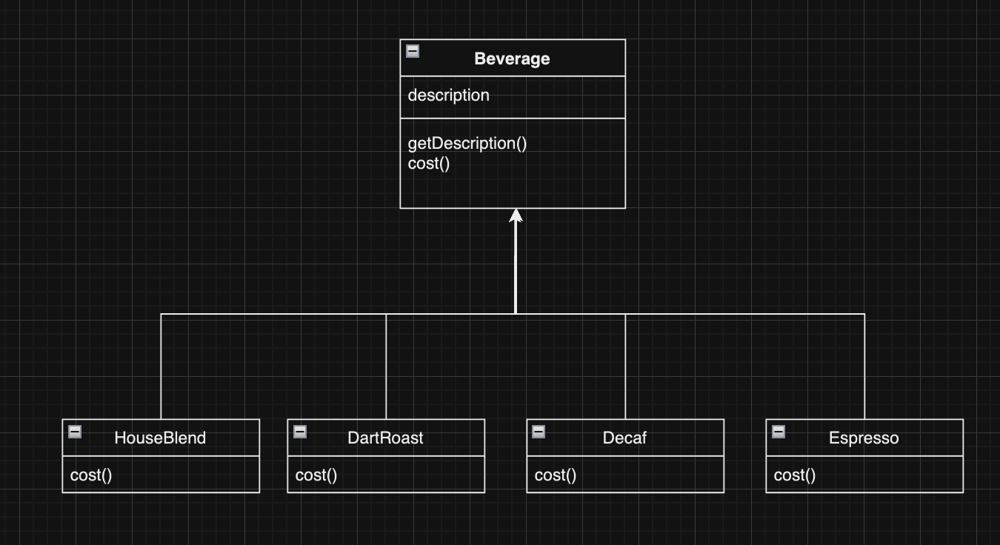
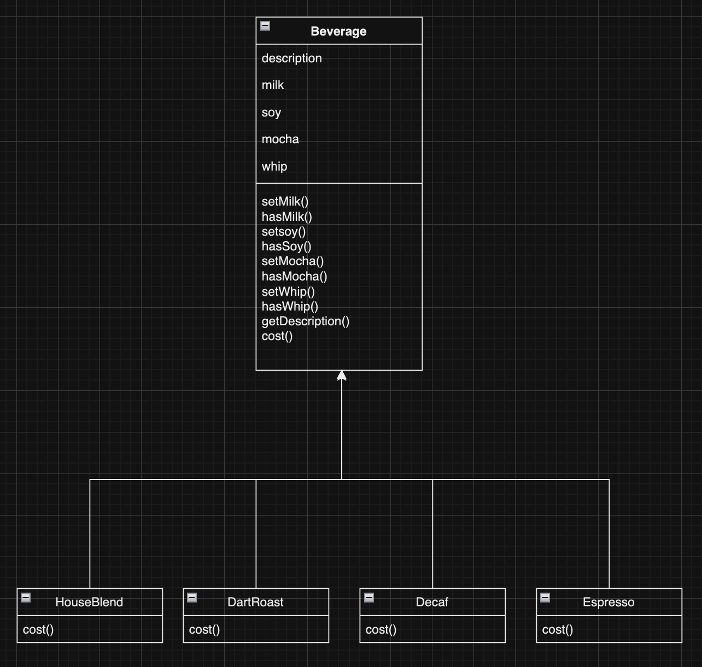
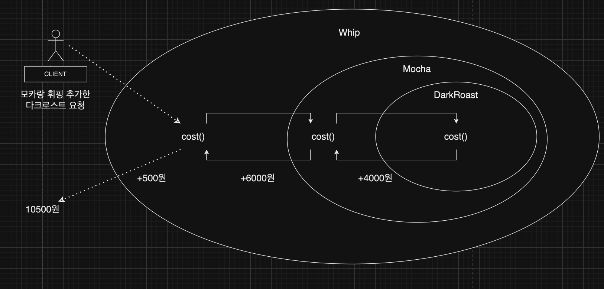

## 데코레이터 패턴
객체에 동적으로 새로운 기능을 추가하거나 변경 할 수 있는 방법을 제공합니다.
이 패턴은 상속을 사용하지 않고 객체의 구조를 수정하지 않으면서 기능을 확장
하려는 경우 유용합니다. OCP를 준수합니다.

### OCP
클래스 확장에 열려있고 변경에 닫혀있어야 하는 디자인 원칙 입니다.

### 1. 데코레이터 패턴을 사용해야 할 CASE
* 초기 커피 주문 시스템

**문제점**

손님이 원하는 기호에 맞게 다양한 옵션으로 주문 할 수 있습니다.
ex) 모카와 휘핑크림을 추가한 다크 로스트 커피
따라서 옵션이 추가 될수록 Beverage를 상속받는 클래스를 어마어마하게 만들어야 합니다. 이렇게 되면 관리가 매우 힘들것입니다.

* 서브 클래스를 사용해 리팩토링

**문제점**

클래스를 엄청 줄일 수 있지만 서브 클래스를 만드는 방식은 컴파일시 행동이 결정되기떄문에 서브클래스가 사용하지 않는 행동도 상속받게 될것입니다.
클라이언트가 주문한 옵션에 엉뚱한 옵션이 넣어져 주문될 수 도 있습니다.
또한 OCP 원칙도 어긋나게 됩니다.

**데코레이터 패턴을 사용하여 개선할 수 있습니다.**

### 2. 데코레이터 패턴 사용한 설계
간단히 말해서 음료에 첨가물을 장식하는 방법이라고 생각할 수 있습니다.

1. DarkRoast 객체에서부터 시작합니다.
2. 클라이언트가 모카를 추가했기때문에 Mocha객체를 생성하고 그 객체로 DarkRoast를 감쌉니다.
3. 클라이언트가 휘핑크림을 추가했기 떄문에 Whip 객체를 만들고 그 객체로 Mocha객체를 감쌉니다.
4. whip 의 cost() 메서드를 호출합니다. whip가 장식하고 있는 객체에게 가격계산을 위임되고 가격이 구해지고 나면 구해진 가격에 whip의 가격을 더한 다음 그 결과를 리턴하게됩니다.

* 데코레이터의 슈퍼 클래스는 데코레이터가 장식하고 있는 객체의 슈퍼 클래스와 같게 합니다.
* 데코레이터는 자신이 감싸고 있는 객체와 같은 슈퍼클래스를 가지고 있기 떄문에 원래 객체가 들어갈 자리에 데코레이터 객체를 집어넣어도 상관없습니다.
* 데코레이터는 자신이 장식하고 있는 객체에서 어떤 행동을 위임하는 것 외에 원하는 추가적인 작업을 수행할 수 있습니다.
* 객체는 언제든지 감쌀 수 있기 떄문에 실행중에 필요한 데코레이터를 마음대로 적용이 가능합니다.

### 3. 데코레이터 패턴 구현
### Q1.
