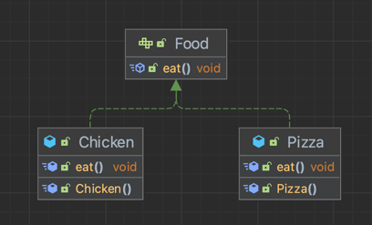
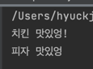
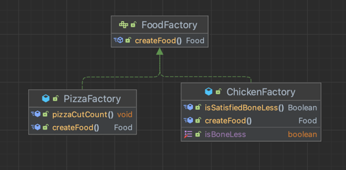
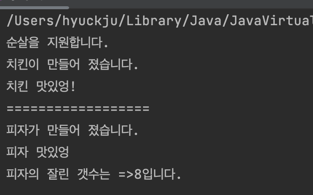
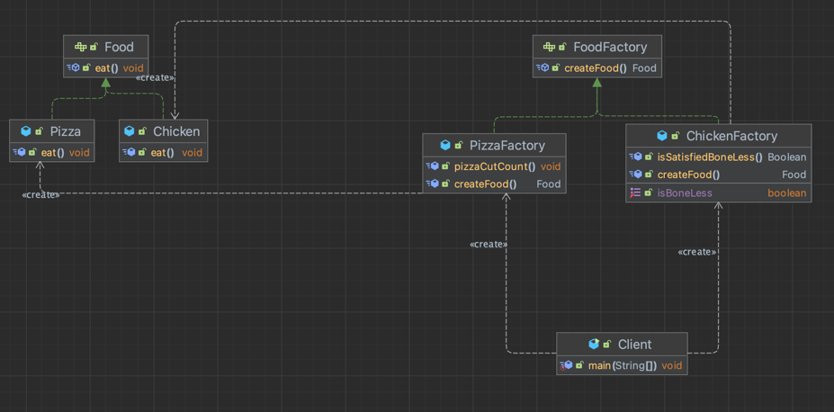
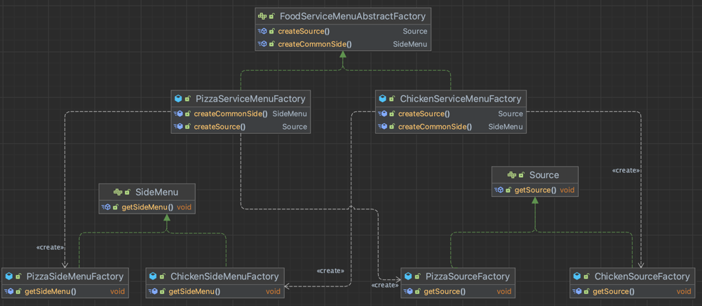

## 팩토리 패턴 (Factory Pattern)

----
- 객체를 생성하는 코드만 분리하여 클라이언트가, 특정 객체의 생성과정을 몰라도 쉽게 생성할수 있게 해주는 패턴이다.
- OCP를 지키기 위해 변경 가능성이 큰 객체 생성을 담당하는 클래스를 분리한다.

### 팩토리 => 공장(class or function)
- 오브젝트를 찍어 낼수 있는 공장

피자, 치킨
- (그림추가)
food(상위 클래스) -> chikine, pizza


client는 그냥 공장에 "피자를 만들어줘", "치킨을 만들어줘"만 알려주면 공장에서 해당 음식의 생성과정을 통해서 음식을 전달해준다.
- 즉, 생성과정을 알 필요가 없다는 이야기랑 같다.


### 팩토리 패턴 구현하기
- 팩토리 메서드 패턴을 구현해보면 다음과 같다
```java
public interface Food {
    public void eat();
}

public class Chicken implements Food {
    @Override
    public void eat() {
        System.out.println("치킨 맛있엉!");
    }
}

public class Pizza implements Food {
    @Override
    public void eat() {
        System.out.println("피자 맛있엉");
    }
}
```

```java
// 음식 만드는 공장
public class Factory {
    // 현업에서는 enum으로 정의해야함(type-safety)
    public Food createFood(String foodName) {
        if(foodName.equals("CHICKEN")) {
            return new Chicken();
        } else if(foodName.equals("PIZZA")){
            return new Pizza();
        }
        return null;
    }
}
```
```java
public static void main(String[] args) {
    Factory factory = new Factory();
    Food chicken = factory.createFood("CHICKEN");
    chicken.eat();

    Food pizza = factory.createFood("PIZZA");
    pizza.eat();
}
```
### 결과


이러한 object 생성과정을 클라이언트가 직접 다룰 필요가 없다.
- 위 예제가 간단하기 때문에 공감이 안될수도 있으니 예시를 하나 추가해보겠다.

피자를 만들기 위해서는 총4가지의 과정이 필요했다면??
```text
- 준비
- 굽기
- 자르기
- 포장하기
```
(4가지 절차가 있는 그림 넣기)

- 클라이언트는 지금과 다른것 없이 피자를 주문할수 있을것 이다.

- 이게 팩토리 패턴의 장점이다.
- 클라이언트 입장에서는 객체를 생성하기위한 위와 같은 과정을 몰라도 `PIZZA` 키워드만 보냄으로써 해당 객체를 쉽게 생성할수 있도록 해주는것이 이 패턴의 핵심이다.


### 팩토리 패턴 한계
- 요구사항이 추가되면서, 음식에 따라 필요한 메서드들이 생기게 되었다.

  - 피자는 잘라지는 조각 갯수를 제공해야했고, 
  - 순살로 변경해서 주문하는것이 가능한지 여부를 제공해야했다.

이런 경우에는 추가구현을 하는건 어려움이 있다. 하나의 팩토리에 모든 생성 객체에 대한 코드가 들어가기 때문에 복잡해진다.

- 이러한 문제를 팩토리 메서드 패턴에서 해결할수 있다.
  - 팩토리 패턴의 생성 메서드를 Interface로 만들고, 각각 객체에 맞는 factory를 생성한다. (피자, 치킨)
- (그림 추가, 피자 치킨에 대한 각각 생성)

- 객체에 따라 따로 팩토리를 만들었음으로, 객체에따라 기능구현이 가능해진다.
  (`피자를 몇조각으로 짜르는지, 치킨은 순살이 가능한지 여부`)

코드로 한번 살펴보자

### 팩토리 메서드 패턴 구현하기
```java

public interface FoodFactory {
    public Food createFood();
}

// 피자 공장
public class PizzaFactory implements FoodFactory {
    private Long pizzaCutCount;

    public PizzaFactory() {
        pizzaCutCount = 8L;
    }

    public void pizzaCutCount() {
        System.out.println("피자의 조각 갯수는 => " + pizzaCutCount + "입니다.");
    }

    @Override
    public Food createFood() {
        System.out.println("피자가 만들어 졌습니다.");
        return new Pizza();
    }
}

// 치킨공장
public class ChickenFactory implements FoodFactory {
    // 순살여부를 지원하는가
    private boolean isBoneless;

    public ChickenFactory() {
        isBoneless = true;
    }

    public ChickenFactory(boolean isBoneless) {
        this.isBoneless = isBoneless;
    }

    public void setIsBoneLess(boolean isBoneless) {
        this.isBoneless = isBoneless;
    }

    public Boolean isSatisfiedBoneLess()  {
        if(isBoneless) {
            System.out.println("순살을 지원합니다.");
        } else {
            System.out.println("순살을 지원하지 않습니다.");
        }

        return isBoneless;
    }


    @Override
    public Food createFood() {
        System.out.println("치킨이 만들어 졌습니다.");
        return new Chicken();
    }
}
```

```java
public static void main(String[] args) {
    ChickenFactory chickenFactory = new ChickenFactory();

    /**
     * 순살 가능여부 체크
     */
    Boolean satisfiedBoneLess = chickenFactory.isSatisfiedBoneLess();
    if(satisfiedBoneLess) {
      Food food = chickenFactory.createFood();
      food.eat();
    }

    System.out.println("==================");

    PizzaFactory pizzaFactory = new PizzaFactory();
    Food food = pizzaFactory.createFood();
    food.eat();
    pizzaFactory.pizzaCutCount();
    }
}
```
### 결과


### 전체구조


팩토리 메서드 패턴의 핵심은, factory interface가 있고, 각 객체마다 해당 interface의 object creater를 구현하고 있다는것이 핵심이다.

- 실제 현업에서는 서브클래스의 네이밍을 다르게 쓰는 경우가 있다. `~~Manager, ~~Creator`
   - object creater 하는 메서드가 상속되어있다면, 팩토리 메서드 패턴을 사용했구나 라고 이해하면된다.

- 이 패턴에서는 하나의 오브젝트가 == 하나의 factory와 매칭이 될 필요는 없다.(여러개가 매칭되어도됨)
- 오브젝트를 생성하는 메서드가 상속이 되었는가, 즉, 오브젝트를 만들어 내는 클래스가 상속이되어있느냐를 핵심으로 본다면 필요한 시점에 활용하기 좋을것 이다.


### 팩토리 메서드 패턴의 한계

---
- 추가 요청이 들어오게되었다.

- 모든 음식에, 서비스 메뉴(사이드메뉴, 소스)를 제공을 해줘야한다는 내용이였다.
- 팩토리 메서드 패턴은 필요한 객체 한개를 구현하는것이지 이 객체와 연관된 다른 객체들을 생성하는 구조가 아니였다.

- 추상 팩토리 메서드를 활용하여 이 문제를 해결할수 있다.

- 구조는 이와 같다.

`FoodServiceMenuAbstractFactory`
- 어떤 서비스 메뉴를 제공해 줄지에 대한 인터페이스

`PizzaServiceMenuFactory`, `ChickenServiceMenuFactory`
- 각 객체에 대한 서비스 메뉴를 가지고 오고 싶을때 의존하는 팩토리(공장)
- 필요한 서비스 메뉴(사이드 메뉴, 소스)들을 생성해주는 메서드를 가지고 있다.

`SideMenu`, `Source`
- 각 서비스 메뉴에 대한 인터페이스

`PizzaSideMenuFactory`, `PizzaSourceFactory`, `ChickenSideMenuFactory`, `ChickenSourceFactory`
- 각 메뉴에대한 사이드의 구현 내용을 작성한다.


- 각 객체(치킨, 피자)에 해당하는 서비스 물품에 해당하는 제품(소스, 사이드메뉴)를 구현한다.
- 이후, 이 모든 서비스 물품을 제공해 해줄수 있는 Factory(`PizzaServiceMenuFactory`, `ChickenServiceMenuFactory`)를 정의한다. 
- 필요한곳에서 해당 팩토리를 사용하여 서비스 메뉴를 가져온다.
* 
### 추상 팩토리 메서드 패턴 구현하기

---


```java
// 소스의 대한 구현
public interface Source {
  public void getSource();
}


public class ChickenSourceFactory implements Source {
    @Override
    public void getSource() {
        System.out.println("추가 소스로 => 매운 양념과, 소금이 제공됩니다.");
    }
}

public class PizzaSourceFactory implements Source {
    @Override
    public void getSource() {
        System.out.println("추가 소스로 => 핫소스가 제공됩니다.");
    }
}
```

```java
public interface SideMenu {
    public void getSideMenu();
}

public class ChickenSideMenuFactory implements SideMenu {
    @Override
    public void getSideMenu() {
        System.out.println("사이드 메뉴로 치킨무가 제공됩니다~~!!!");
    }
}

public class PizzaSideMenuFactory implements SideMenu {
    @Override
    public void getSideMenu() {
        System.out.println("사이드 메뉴로 감자튀김이 제공됩니다~~!!!");
    }
}
```

```java
public interface FoodServiceMenuAbstractFactory {
    /**
     * 음식에 따른 소스 제공
     */
    public Source createSource();

    /**
     * 음식에 따른 사이드 메뉴 제공한다.
     */
    public SideMenu createCommonSide();
}

public class ChickenServiceMenuFactory implements FoodServiceMenuAbstractFactory {
    @Override
    public Source createSource() {
        return new ChickenSourceFactory();
    }

    @Override
    public SideMenu createCommonSide() {
        return new ChickenSideMenuFactory();
    }
}

public class PizzaServiceMenuFactory implements FoodServiceMenuAbstractFactory {
    @Override
    public Source createSource() {
        return new PizzaSourceFactory();
    }

    @Override
    public SideMenu createCommonSide() {
        return new PizzaSideMenuFactory();
    }
}


public class ChickenFactory implements FoodFactory {
    ...
    
    @Override
    public Food createFood() {
        System.out.println("치킨이 만들어 졌습니다.");

        // 추가@@
        ChickenServiceMenuFactory chickenServiceMenuFactory = new ChickenServiceMenuFactory();
        chickenServiceMenuFactory.createSource().getSource();
        chickenServiceMenuFactory.createCommonSide().getSideMenu();

        return new Chicken();
    }
}

public class PizzaFactory implements FoodFactory {
    ...
    
    @Override
    public Food createFood() {
        System.out.println("피자가 만들어 졌습니다.");

        // 추가@@
        FoodServiceMenuAbstractFactory pizzaServiceMenuFactory = new PizzaServiceMenuFactory();
        pizzaServiceMenuFactory.createSource().getSource();
        pizzaServiceMenuFactory.createCommonSide().getSideMenu();

        return new Pizza();
    }
}
```

### 팩토리 메소드 vs 추상 팩토리 패턴
- 팩토리 패턴은 한 종류의 객체를 생성하기 위해 사용(추상화의 정도는 개발에 따라 다름, 치킨이될찌, 음식이될지)
- 
- 추상 팩토리 패턴은 생성된 객체와 연관되거나 의존적인 객체로 이루어진 또다른 종류의 객체를 생성하기 위해 사용(치킨에 대한 서비스 메뉴 리스트)
- 
- 팩토리 패턴은 팩토리 인터페이스를 구현, 추상 팩토리는 팩토리 객체가 아닌 다른 객체 내부에 구현되어 해당 객체에서 여러 타입의 객체를 생성하기 위해 사용.

Abstract Factory 패턴은 Factory Method 패턴보다 한 단계 높은 추상화 수준이다.
유사점과 차이점을 조합해서 복합 패턴을 구성하는 것도 가능하다.

### 팩토리 메서드 패턴 단점
- 각 제품 구현체마다 팩토리 객체들을 모두 구현해주어야 하기 때문에, 구현체가 늘어날때 마다 팩토리 클래스가 증가하여 서브 클래스 수가 폭발한다.
- 코드의 복잡성이 증가한다.
