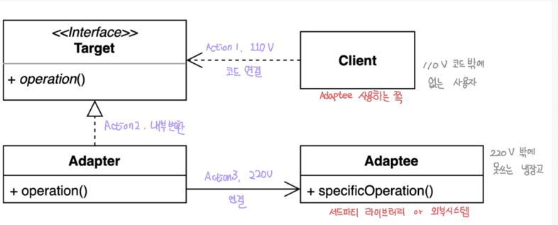
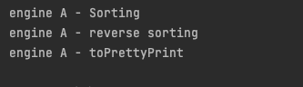
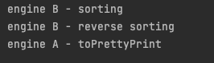
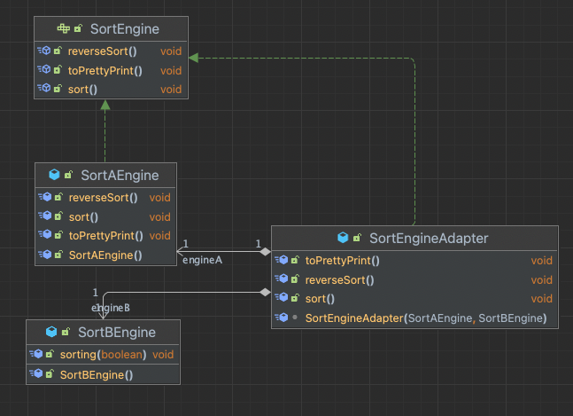

### 어탭터 패턴

"서로 다른 인터페이스를 사용할 수 있도록 바꿔 줌으로써 기존 코드를 재사용할수 있게 해준다."



- 기존코드를 클라이언트가 사용하는 인터페이스의 구현체로 바꿔주는 패턴


구성요소
- 클라이언트는 항상 Target 인터페이스만 사용하는 형태
- Adaptee에 해당하는 클래스(ex. 한국에서 미국으로 들고온 한국 냉장고)
- Target과 Adaptee 사이를 이어주는 Adapter

---

어탭터 패턴을 적용해야하는 상황을 가정해보자

- sorting을 전문적으로 하는 A 회사에서 빠른 속도를 자랑하는 인터페이스를 제공해주어서 해당 기능을 사용하고 있던 상황이다.
```java

public interface SortEngine {
    public void sort(); // 정렬 알고리즘
    public void reverseSort(); // 역순 정렬 알고리즘
    public void toPrettyPrint(); // 정렬된 리스트를 예쁘게 출력
}

// A업체에서 제공한 엔진 
public class SortAEngine implements SortEngine {
    @Override
    public void sort() {
        System.out.println("engine A - Sorting");
    }

    @Override
    public void reverseSort() {
        System.out.println("engine A - reverse sorting");
    }

    @Override
    public void toPrettyPrint() {
        System.out.println("engine A - toPrettyPrint");
    }
}
```


```java
public class Client {
    public static void main(String[] args) {
        SortEngine engine = new SortAEngine();

        engine.sort();
        engine.reverseSort();
        engine.toPrettyPrint();
    }
}
```
- 결과



---

그렇게 사용하던 중, B업체가 만든 Sort가 2배나 빠른 속도를 지원한다고해서 알아보았다.

```java
// 성능이 향상된 SortEngine 제공
class B_SortEngine { 
    public void sorting(boolean isReverse) {} // 정렬 / 역순 정렬 알고리즘 (파라미터로 순서 결정)
}
```
- 보니깐.. 기존에 제공되던 형태와 다른형태를 띄고 있었다.
  - `toPrettyPrint` 미제공
  - `sort, reverseSort` 통합


### 고민점들..
- B_sortEngine에서 구현되어있지 않은 메서드들은 새로 구현해야하나??
- 나는 기존에 활용했었던 toPrettyPrint 메서드도 사용하고 싶은데, 그건 불가능한가??
- 사용자들도 기존에 제공되던 인터페이스가 아닌 다른 인터페이스가 제공된다면 헷갈리지 않을까??


---
### 어댑터 패턴을 활용한 개선


```java
public class SortEngineAdapter implements SortEngine {
    SortAEngine engineA;
    SortBEngine engineB;

    SortEngineAdapter(SortAEngine engineA, SortBEngine engineB) {
        this.engineA = engineA;
        this.engineB = engineB;
    }

    @Override
    public void sort() {
        engineB.sorting(true);
    }

    @Override
    public void reverseSort() {
        engineB.sorting(false);
    }

    @Override
    public void toPrettyPrint() {
        engineA.toPrettyPrint();
    }
}
```

```java
public class Client {
    public static void main(String[] args) {
        SortEngine engine = new SortEngineAdapter(new SortAEngine(), new SortBEngine());

        engine.sort();
        engine.reverseSort();
        engine.toPrettyPrint();
    }
}
```
- 결과




- 클라이언트는 기존에 사용하던 기능들을 모두 그대로 제공받을수 있다.
- 엔진도 효율적인 엔진에 맞춰서 적용을 했음으로 성능도 향상된다.

따라서, 우리회사의 sort엔진에서 이용하던 인터페이스는 손대지 않고, 새로운 어댑터를 상황에 맞춰서 사용할수 있게 되었다. 

