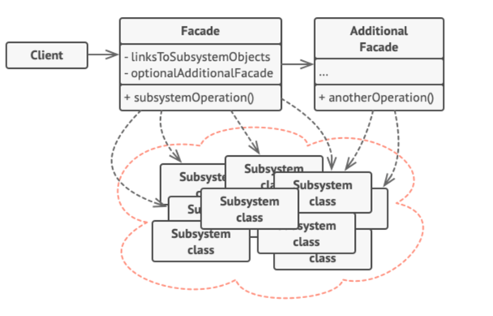

### 파사드 패턴(facade_pattern)
- 사용하기 복잡한 클래스 라이브러리에 대해 사용하기 편하게 간편한 인터페이스(API)를 구성하기 위한 구조 패턴 이다




---

- 퍼사드 패턴은 전략 패턴이나 팩토리 패턴과 같은 여타 다른 디자인 패턴과는 다르게 클래스 구조가 정형화 되지 않은 패턴이다. 
- 반드시 클래스 위치는 어떻고 어떤 형식으로 위임을 해야되고 이런것이 없다. 
- 클라이언트로 하여금 복잡한 것들을 의식하지 않도록 해준다는것이 핵심이다.


### 구현 해보기
```java
public class Facade {
    // 이러한 서브 클래스들을 몰라도 사용가능
    public void view() {
        Beverage beverage = new Beverage("콜라");
        Remote_Control remote= new Remote_Control();
        Movie movie = new Movie("어벤져스");

        beverage.Prepare();  //음료 준비
        remote.Turn_On();   //tv를 켜다
        movie.Search_Movie();  //영화를 찾다
        movie.Charge_Movie();  // 영화를 결제하다
        movie.play_Movie();   //영화를 재생하다
    }
}

public class Client {
    public static void main(String[] args) {
        Facade facade = new Facade();
        facade.view();
    }
}
```

### 퍼사드 패턴의 중요 포인트!

- 퍼사드 패턴은 클라이언트 어플리케이션의 헬퍼 역할을 하는 것이지, **서브시스템 인터페이스를 숨기는 것은 아니다.**
- 퍼사드 패턴은 특정 기능에 대해 인터페이스의 수가 확장되고, 시스템이 복잡해질 수 있는 상황에서 사용하기 적합하다.
- 퍼사드 패턴은 비슷한 작업을 해야하는 다양한 인터페이스들 중 하나의 인터페이스를 클라이언트에 제공해야 할 때 적용하는 것이 좋다.
- 파사드 패턴은 하나만 있어도 충분하므로, 싱글톤 패턴을 활용해서 구성해준다면 좋다.