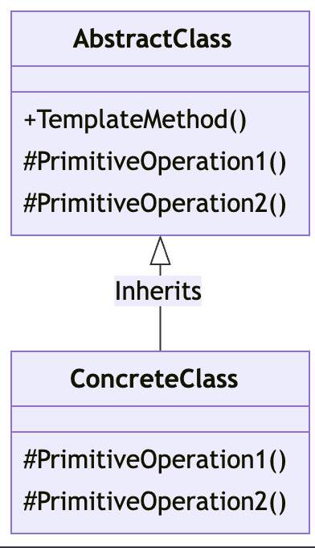

## 템플릿 메소드 패턴
특정한 알고리즘 구조를 정의하고 알고리즘의 일부 단계를 서브 클래스에서
구현할 수 있습니다. 알고리즘의 전체 구조를 고정하면서 일부 단계를 서브 클래스에서 변경 할 수 있습니다.

### 1. 템플릿 메소드 패턴을 사용하는 이유
이 패턴은 코드 재사용과 확장성을 높이는데 도움을 주고 상위 수준의
알고리즘을 정의하고 하위 수준에서 구체적인 동작을 구현할 때 유용합니다.
이 패턴을 사용하면 코드 중복을 줄일 수 있고 유지보수를 쉽게 할 수 있습니다.

### 2. 템플릿 메소드 패턴의 주요 구성요소
* 템플릿 메소드
알고리즘의 구조를 정의한 메소드로, 이 메소드 안에 서 일련의 단계를 순서대로 실행합니다.
이 메소드는 고정된 알고리즘 구조를 가지며, 특정 단계를 추상 메소드나 서브클래스에서 구현할 수 있는 추상 메소드를 호출합니다.

* 추상 메소드
서브클래스에서 반드시 구현해야 하는 메소드로, 알고리즘의 일부 단계를 정의합니다. 
이 추상 메소드들을 구현함으로써 템플릿 메소드 패턴을 이용해 알고리즘의 구체적인 동작을 결정할 수 있습니다.

* 훅 메소드
템플릿 메소드에서 선택적으로 오버라이딩할 수 있는 메소드로 서브클래스에서 필요에 따라 구현할 수 있습니다.
훅 메소드를 통해 알고리즘의 일부를 변경하거나 확장할 수 있습니다.

### 템플릿 메소드 패턴의 구조


### 3. 간단한 템플릿 메소드 패턴의 구현

Beverage 클래스
```java
abstract class Beverage {
    // 템플릿 메소드: 준비 과정을 정의
    public final void prepareBeverage() {
        boilWater();
        brew();
        pourInCup();
        if (customerWantsCondiments()) {
            addCondiments();
        }
    }

    // 서브클래스에서 구현해야 할 추상 메소드들
    abstract void brew();
    abstract void addCondiments();

    // 다음은 공통 메소드들
    void boilWater() {
        System.out.println("물 끓이는 중");
    }

    void pourInCup() {
        System.out.println("컵에 따르는 중");
    }

    // 훅 메소드: 서브클래스에서 선택적으로 오버라이딩 가능
    boolean customerWantsCondiments() {
        return true;
    }
}
```

coffee 클래스(서브클래스)
```java
class Coffee extends Beverage {
    @Override
    void brew() {
        System.out.println("필터로 커피를 우려내는 중");
    }

    @Override
    void addCondiments() {
        System.out.println("설탕과 우유를 추가하는 중");
    }
}
```

클라이언트
```java
public class TemplateMethodPatternExample {
    public static void main(String[] args) {
        Beverage coffee = new Coffee();
        Beverage tea = new Tea();

        System.out.println("커피 만들기:");
        coffee.prepareBeverage();

        System.out.println("\n차 만들기:");
        tea.prepareBeverage();
    }
}
```

### Q1. 탬플릿 메소드 패턴으로 게임 캐릭터 구현하기
컴퓨터 게임을 개발중 여러 종류에 캐릭터가 있고 그 캐릭터의 공격 수행 방식이 다르다.
- 아래 메소드를 사용하기

attack() -> 공격 수행 단계 정의

prepareWeapon() -> 추상 메소드

performAttack() -> 추상 메소드

isSpecialAbilityEanabled() -> 훅

useSpecialAbility() -> 훅

- 두개 이상의 캐릭터 클래스를 구현 ex) warrior, wizard

