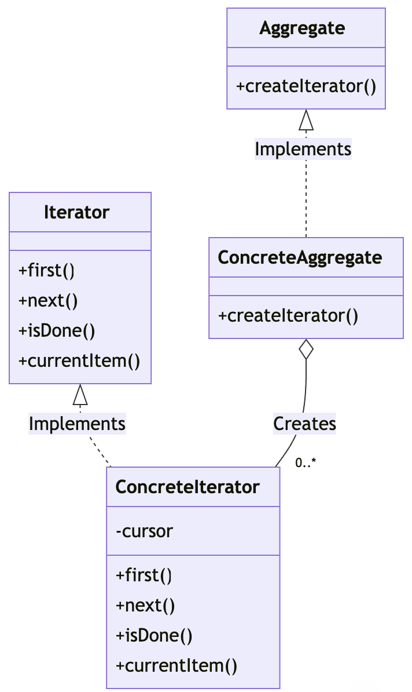

## 반복자 패턴
반복자 패턴은 객체지향 프로그래밍에서 컬랙션 내의 요소들을 순차적으로 접근하는 방법을 제공합니다.

### 1. 반복자 패턴을 사용하는 이유
컬랙션 구현 방식에 상관없이 요소들을 순회할 수 있는 통일된 인터페이스를 제공하기 유용합니다.


### 2. 반복자 패턴의 주요 구성요소
* Iterator(반복자)
컬랙션의 요소에 접근하고 순회를 위한 인터페이스를 정의합니다.
일반적으로 next(), hasnext(), remove()와 같은 메소드를 제공합니다.

* Concrete Iterator(구체적 반복자)
Iterator 인터페이스를 구현하고 컬렉션의 특정 구현에 대한 순회 로적을 포함합니다.

* Aggregate(집합체)
반복자 객체를 생성할 수 있는 인터페이스를 정의합니다.

* Concrete Aggregate(구체적 집합체)
Aggregate 인터페이스를 구현하고, 특정 컬렉션에 대한 Iterator를 생성합니다.

### 반복자 패턴의 구조


### 3. 간단한 반복자 패턴의 구현

Iterator 인터페이스
```java
interface Iterator {
    boolean hasNext();
    Object next();
}
```

Aggregate 인터페이스
```java
interface Aggregate {
    Iterator createIterator();
}
```

ConcreteIterator
```java
class StringIterator implements Iterator {
    private ArrayList<String> collection;
    private int position = 0;

    public StringIterator(ArrayList<String> collection) {
        this.collection = collection;
    }

    @Override
    public boolean hasNext() {
        return position < collection.size();
    }

    @Override
    public Object next() {
        if (this.hasNext()) {
            return collection.get(position++);
        }
        return null;
    }
}
```

ConcreteAggregate
```java
class StringCollection implements Aggregate {
    private ArrayList<String> collection = new ArrayList<>();

    public void add(String item) {
        collection.add(item);
    }

    // 컬렉션에 대한 반복자를 생성하고 반환
    @Override
    public Iterator createIterator() {
        return new StringIterator(collection);
    }
}
```

클라이언트
```java
public class IteratorPatternDemo {
    public static void main(String[] args) {
        StringCollection collection = new StringCollection();
        collection.add("John");
        collection.add("Jane");
        collection.add("Emily");

        Iterator iterator = collection.createIterator();
        while (iterator.hasNext()) {
            String name = (String)iterator.next();
            System.out.println(name);
        }
    }
}
```


