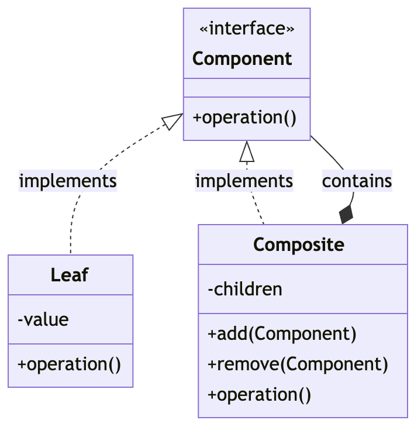

## 컴포지트 패턴
객체 지향 패턴 중 하나로 클라이언트가 개별 객체와 객체의 집합을 
동일하게 다룰 수 있도록 해주는 구조적 패턴

### 1. 컴포지트 패턴을 사용하는 이유
클라이언트로 하여금 개별 객체와 복합 객체를 동일하게 취급할 수 있게 해줌으로써
복합성을 줄여줍니다.

### 2. 컴포지트 패턴의 주요 구성요소
* Component(구성 요소)

모든 객체(개별 객체 및 복합 객체)에 공통적인 인터페이스 또는 추상 클래스입니다. 
클라이언트는 이 인터페이스를 통해 개별 객체와 복합 객체를 동일하게 다룰 수 있습니다. 

* Leaf(잎)

구성 요소의 기본 행동을 구현하는 클래스로 
복합 객체의 구성 요소가 될 수 없는 개별 객체를 나타냅니다.

* Composite(복합체)

복수의 Component(잎 또는 다른 복합체)를 포함할 수 있는 클래스입니다.
Composite는 Component 인터페이스를 구현하며 자식 Component를 관리하는 메서드를 제공합니다.


### 컴포지트 패턴의 구조


### 간단한 컴포지트 패턴의 구현

MenuComponent 인터페이스
```java
abstract class MenuComponent {
    public void add(MenuComponent menuComponent) {
        throw new UnsupportedOperationException();
    }

    public void remove(MenuComponent menuComponent) {
        throw new UnsupportedOperationException();
    }

    public MenuComponent getChild(int i) {
        throw new UnsupportedOperationException();
    }

    public String getName() {
        throw new UnsupportedOperationException();
    }

    public String getDescription() {
        throw new UnsupportedOperationException();
    }

    public double getPrice() {
        throw new UnsupportedOperationException();
    }

    public boolean isVegetarian() {
        throw new UnsupportedOperationException();
    }

    public void print() {
        throw new UnsupportedOperationException();
    }
}
```

MenuItem 클래스 (leaf)
```java
class MenuItem extends MenuComponent {
    String name;
    String description;
    boolean vegetarian;
    double price;

    public MenuItem(String name, String description, boolean vegetarian, double price) {
        this.name = name;
        this.description = description;
        this.vegetarian = vegetarian;
        this.price = price;
    }

    public String getName() {
        return name;
    }

    public String getDescription() {
        return description;
    }

    public double getPrice() {
        return price;
    }

    public boolean isVegetarian() {
        return vegetarian;
    }

    public void print() {
        System.out.print("  " + getName());
        if (isVegetarian()) {
            System.out.print("(v)");
        }
        System.out.println(", " + getPrice());
        System.out.println("     -- " + getDescription());
    }
}
```

Menu 클래스 (Composite)
```java
class Menu extends MenuComponent {
    java.util.ArrayList<MenuComponent> menuComponents = new java.util.ArrayList<>();
    String name;
    String description;

    public Menu(String name, String description) {
        this.name = name;
        this.description = description;
    }

    public void add(MenuComponent menuComponent) {
        menuComponents.add(menuComponent);
    }

    public void remove(MenuComponent menuComponent) {
        menuComponents.remove(menuComponent);
    }

    public MenuComponent getChild(int i) {
        return menuComponents.get(i);
    }

    public String getName() {
        return name;
    }

    public String getDescription() {
        return description;
    }

    public void print() {
        System.out.print("\n" + getName());
        System.out.println(", " + getDescription());
        System.out.println("---------------------");

        java.util.Iterator<MenuComponent> iterator = menuComponents.iterator();
        while (iterator.hasNext()) {
            MenuComponent menuComponent = iterator.next();
            menuComponent.print();
        }
    }
}
```

클라이언트
```java
public class MenuTestDrive {
    public static void main(String args[]) {
        MenuComponent pancakeHouseMenu = new Menu("PANCAKE HOUSE MENU", "Breakfast");
        MenuComponent dinerMenu = new Menu("DINER MENU", "Lunch");
        MenuComponent cafeMenu = new Menu("CAFE MENU", "Dinner");
        MenuComponent dessertMenu = new Menu("DESSERT MENU", "Dessert of course!");

        MenuComponent allMenus = new Menu("ALL MENUS", "All menus combined");

        allMenus.add(pancakeHouseMenu);
        allMenus.add(dinerMenu);
        allMenus.add(cafeMenu);

        // 메뉴 아이템 추가
        dinerMenu.add(new MenuItem("Pasta", "Spaghetti with Marinara Sauce", true, 3.89));
        dinerMenu.add(dessertMenu);

        dessertMenu.add(new MenuItem("Apple Pie", "Apple pie with a flakey crust", true, 1.59));

        // 메뉴 출력
        allMenus.print();
    }
}
```